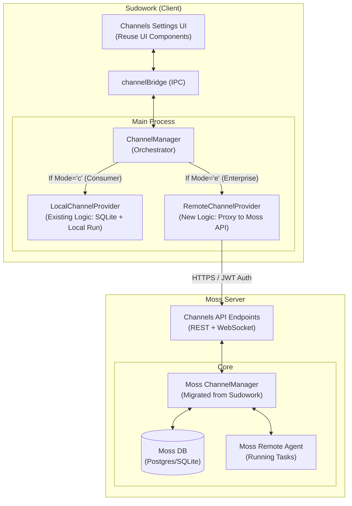

# Sudowork Channels 混合模式（个人/企业）实现方案

## 1. 概述

本方案旨在将 Sudowork 的 Channels（渠道/通道）功能适配为支持“个人模式”与“企业模式”的混合架构。

- **个人模式**：保持现状，逻辑完全在本地运行，连接本地 Agent。
- **企业模式**：复用 Sudowork 的 UI 配置界面，但后端逻辑与 Agent 运行均迁移至 Moss Server。

## 2. 软件架构

### 2.1 整体架构图

### 2.2 核心逻辑流

1. **模式检测**：Sudowork 启动及运行时通过 `eeclawMode.isEnterpriseMode()` 检测当前运行模式。
2. **Provider 抽象**：引入 `IChannelProvider` 接口，屏蔽本地存储与远程 API 的差异。
3. **UI 同步**：Channels 配置页面通过 `channelBridge` 发送指令。`ChannelManager` 根据模式决定是操作本地数据库还是调用远程 Moss API。
4. **Agent 触发**：企业模式下，IM 渠道收到的消息由 Moss Server 内部处理，并触发 Moss 上的 Remote Agent，实现全链路云端化。

## 3. 接口设计 (API Design)

Moss Server 需要新增以下 API 以支持远程管理：

### 3.1 渠道插件管理 (REST)
- **GET** `/api/v1/channels/plugins`
  - 说明：获取当前用户的所有渠道插件及其状态（运行中/停止）。
- **POST** `/api/v1/channels/plugins/:id/enable`
  - 说明：启用并配置渠道插件。Payload 包含凭据（credentials）与配置（config）。
- **POST** `/api/v1/channels/plugins/:id/disable`
  - 说明：禁用并停止渠道插件。
- **POST** `/api/v1/channels/plugins/:id/test`
  - 说明：测试渠道连通性。

### 3.2 配对与授权 (REST)
- **GET** `/api/v1/channels/pairings/pending`
  - 说明：获取待审批的 IM 用户配对请求。
- **POST** `/api/v1/channels/pairings/:code/approve`
  - 说明：批准配对码。
- **GET** `/api/v1/channels/users`
  - 说明：获取已授权的 IM 用户列表。
- **DELETE** `/api/v1/channels/users/:id`
  - 说明：撤销用户授权。

## 4. 任务拆分 (Task List)

### 4.1 Sudowork 侧任务
1. **Provider 模式实现**：
   - 定义 `IChannelProvider` 接口。
   - 实现 `LocalChannelProvider` (封装现有逻辑)。
   - 实现 `RemoteChannelProvider` (调用 Moss 远程接口)。
2. **模式路由转发**：
   - 修改 `ChannelManager`，在初始化和 IPC 调用时注入正确的 Provider。
3. **凭据安全处理**：
   - 企业模式下，确保凭据在网络传输前的加密处理。

### 4.2 Moss Server 侧任务
1. **代码迁移与集成**：
   - 将 Sudowork 的 `src/channels/` 完整逻辑迁移至 Moss Server。
   - 适配 Moss 的权限模型（通过 JWT 中的 User/Org 隔离数据）。
2. **API 控制器开发**：
   - 实现上述 REST 接口。
   - 开发与 Moss 原生 Agent（AssistantService）的交互逻辑。
3. **管理后台开发**：
   - 在 Moss Admin 管理页面集成渠道监控与配置界面。

## 5. 开发建议
- **凭据传输加密**：建议在企业模式下，Sudowork 使用 Moss Server 的公钥对 Token 等敏感凭据进行加密后再通过 HTTPS 发送。
- **状态轮询与通知**：企业模式下，渠道状态变更建议通过 WebSocket 推送至 Sudowork 客户端，以保证 UI 的实时刷新。
