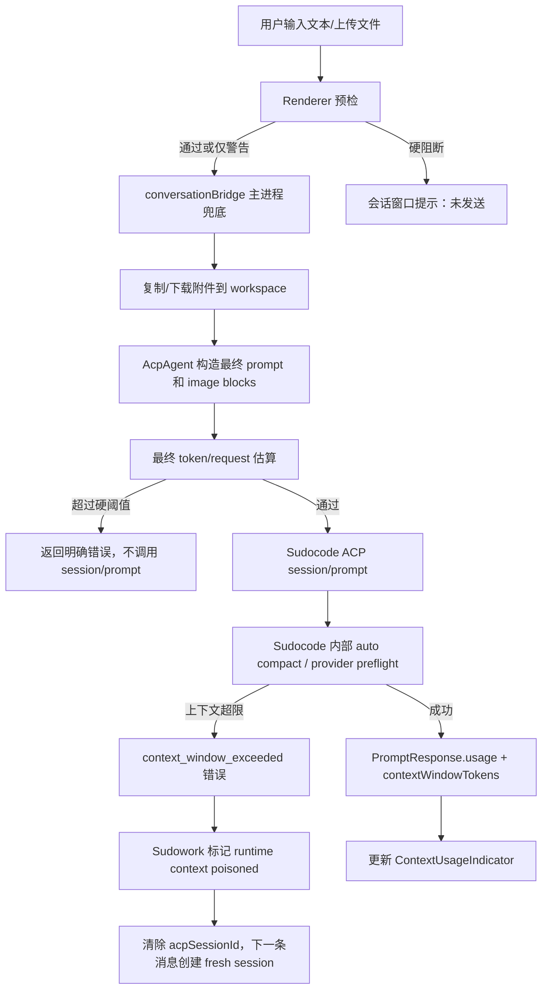

# Sudocode 上下文超限防护与会话恢复设计

**日期**: 2026-05-28  
**状态**: 设计中  
**涉及仓库**:
- Sudowork: `/Users/yobach/Documents/sudowork`
- Sudocode: `/Users/yobach/VSCodeProject/sudocode`

## 背景

当前 Sudowork 使用 Sudocode ACP 对话时，如果用户上传的图片、文件或累计对话历史超过模型上下文限制，Sudocode 会返回用户可读错误，例如“图片或文本内容过大，超出了模型的处理限制”。但这个错误会污染当前 ACP runtime session：后续用户继续在同一个 Sudowork 会话里发送消息时，Sudowork 仍会 resume 同一个 Sudocode session，于是继续触发同样的上下文超限错误，导致这个会话近似永久不可用。

目标不是只把错误文案改好，而是建立完整链路：

1. 发送前尽量发现超限风险，在会话窗口明确提示。
2. Sudocode 端输出模型上下文窗口大小，让 Sudowork 不依赖过期本地表。
3. Sudowork 主进程做最终兜底，覆盖 UI、初始消息、渠道消息和网盘文件等所有入口。
4. 一旦服务端确认上下文超限，后续消息自动丢弃旧 runtime 上下文，保留 UI 历史，让会话可继续使用。

## 当前实现确认

### Sudowork

1. 发送框在 `src/renderer/pages/conversation/acp/AcpSendBox.tsx` 收集 `message + files`，调用 `ipcBridge.acpConversation.sendMessage.invoke(...)`。
2. 主进程在 `src/process/bridge/conversationBridge.ts` 复制文件到 workspace 后，构造统一 payload 调用 `task.sendMessage(payload)`。
3. `src/process/task/AcpAgent.ts` 在 `sendMessage()` 中把文件转成 `@file` 引用，调用 `processAtFileReferences()`，最终在 `sendToConnection()` 中通过 `connection.sendPrompt()` 发给 ACP。
4. `src/agent/acp/AcpConnection.ts` 会解析 ACP `PromptResponse.usage.totalTokens`，并回调 `AcpAgent.handlePromptUsage()`。
5. `AcpAgent.handlePromptUsage()` 目前只发：

```ts
{
  used: usage.totalTokens,
  size: 0,
}
```

6. `AcpAgent.handleSessionUpdate()` 也支持 `usage_update` 事件，并期望里面有 `{ used, size }`，但 Sudocode 当前没有发这个 session update。

### Sudocode

1. Sudocode 当前 ACP `PromptUsage` 位于 `rust/crates/runtime/src/acp_sdk_server.rs`，字段只有：

```rust
pub struct PromptUsage {
    pub input_tokens: u64,
    pub output_tokens: u64,
    pub total_tokens: u64,
    pub cache_read_tokens: Option<u64>,
    pub cache_write_tokens: Option<u64>,
}
```

2. Sudocode ACP `PromptResponse` 只返回标准 usage：

```rust
Usage::new(u.total_tokens, u.input_tokens, u.output_tokens)
    .cached_read_tokens(u.cache_read_tokens)
    .cached_write_tokens(u.cache_write_tokens)
```

3. Sudocode 内部确实知道模型上下文窗口大小。在 `rust/crates/rusty-sudocode-cli/src/main.rs` 中：

```rust
let context_limit = model_token_limit(model)
    .map(|limit| limit.context_window_tokens as usize)
    .unwrap_or(200_000);
```

4. Sudocode 内部已经有 85% 阈值的自动压缩逻辑，但这个信息目前没有通过 ACP 暴露给 Sudowork。

## 设计原则

1. **以 Sudocode 为上下文窗口权威来源**  
   Sudocode 最接近真实模型、网关和 provider 限制，应该返回 `context_window_tokens`。

2. **前端提示，后端兜底**  
   前端只负责体验和即时反馈；真正的阻断、降级、恢复必须在 Sudowork 主进程做。

3. **不要把文件 MB 当成唯一阈值**  
   token、图片尺寸、base64 请求体大小、provider request body limit 都可能导致失败。文件大小只能作为预估因子。

4. **超限后不自动丢 UI 历史**  
   用户仍应看到完整聊天记录。丢弃的是模型 runtime session 的历史上下文，而不是本地消息列表。

5. **恢复策略默认自动执行**  
   一旦确认为上下文超限，下一条消息自动新建 runtime session。不要要求用户手动“清除对话历史后重新开始”。

## 总体方案



## Sudocode 改动设计

### 1. 扩展 PromptUsage

文件：`rust/crates/runtime/src/acp_sdk_server.rs`

新增字段：

```rust
pub struct PromptUsage {
    pub input_tokens: u64,
    pub output_tokens: u64,
    pub total_tokens: u64,
    pub cache_read_tokens: Option<u64>,
    pub cache_write_tokens: Option<u64>,
    pub context_window_tokens: Option<u64>,
    pub estimated_session_tokens: Option<u64>,
}
```

字段含义：

| 字段 | 含义 |
|------|------|
| `context_window_tokens` | 当前模型上下文窗口大小 |
| `estimated_session_tokens` | Sudocode 发送前估算的当前 session token 数 |

`estimated_session_tokens` 不是必须字段，但它对 Sudowork 的 UI 更有价值。`total_tokens` 是累计计费 token，不等同于当前上下文占用；而 `estimate_session_tokens(session.runtime.session())` 更接近“这次请求前后模型上下文里塞了多少内容”。

### 2. 在 ACP PromptResponse.usage 里携带扩展字段

ACP schema 的标准 `Usage` 可能没有 `contextWindowTokens` 字段。如果 `agent_client_protocol_schema::Usage` 不允许扩展字段，有两个选项：

#### 方案 A：通过 PromptResponse `_meta` 返回，推荐

在 `PromptResponse` 上加 `_meta`：

```json
{
  "stopReason": "end_turn",
  "usage": {
    "totalTokens": 12345,
    "inputTokens": 10000,
    "outputTokens": 2345
  },
  "_meta": {
    "sudocode": {
      "contextWindowTokens": 1048576,
      "estimatedSessionTokens": 28000,
      "contextWarningThreshold": 891289
    }
  }
}
```

优点：
- 不破坏 ACP 标准 usage。
- Sudowork 可以兼容读取。
- 其他 ACP 客户端不受影响。

#### 方案 B：发 `SessionUpdate::UsageUpdate`

如果 schema 支持 usage update：

```json
{
  "sessionUpdate": "usage_update",
  "used": 28000,
  "size": 1048576
}
```

优点是 Sudowork 已经有部分处理逻辑。缺点是需要确认 Sudocode 当前依赖的 ACP schema 是否有这个 update 类型，以及字段是否与 Sudowork 假设一致。

**推荐先做方案 A，再由 Sudowork 同时兼容 `_meta.sudocode` 和 `usage_update`。**

### 3. 在超限错误中输出可机器识别的错误码

当前 Sudocode 会返回用户友好的中文错误，但 Sudowork 只能靠字符串判断。建议新增结构化错误信号。

推荐错误 message 保留用户可读内容，同时 `_meta` 或错误 code 带上：

```json
{
  "code": -32001,
  "message": "当前请求内容过大，超出模型处理限制...",
  "data": {
    "code": "context_window_exceeded",
    "estimatedTokens": 1200000,
    "contextWindowTokens": 1048576,
    "recoverableByNewSession": true
  }
}
```

如果 ACP responder 只能返回 message，也至少保证错误字符串包含稳定英文 marker：

```text
[context_window_exceeded] 当前请求内容过大...
```

Sudowork 识别优先级：

1. `error.data.code === "context_window_exceeded"`
2. message 包含 `[context_window_exceeded]`
3. message 包含 `context_window_blocked`
4. message 包含 `context length` / `token limit` / `超出模型处理限制` / `内容过大`

### 4. Sudocode 内部超限处理调整

当前逻辑：

1. 估算当前 session tokens。
2. 超过 85% 时尝试 compact。
3. compact 后仍超过 context limit，则返回错误。

建议增强：

1. 把 `context_limit`、`estimated_tokens`、`new_estimated_tokens` 放入错误 metadata。
2. 明确区分两类失败：
   - `single_request_too_large`: 单次用户输入/图片太大，新 session 也不能恢复。
   - `history_context_too_large`: 历史上下文太大，新 session 可以恢复。

示例：

```rust
enum ContextOverflowKind {
    SingleRequestTooLarge,
    HistoryContextTooLarge,
}
```

判断建议：

- 如果 `message_count <= 4` 且仍超限，基本是单次请求太大。
- 如果 message 多、compact 后失败，属于历史上下文太大。

这会影响 Sudowork 恢复策略：

- `single_request_too_large`: 不清 session，提示用户压缩附件或拆分。
- `history_context_too_large`: 清 session，下条消息自动 fresh runtime。

## Sudowork 改动设计

### 1. 上下文预算数据模型

新增公共类型，建议文件：`src/common/contextBudget.ts`

```ts
export type ContextBudget = {
  modelId: string | null;
  contextWindowTokens: number;
  usedTokens: number;
  estimatedInputTokens: number;
  estimatedAttachmentTokens: number;
  reservedOutputTokens: number;
  warnThresholdTokens: number;
  blockThresholdTokens: number;
  source: 'runtime' | 'sudocode-meta' | 'model-table' | 'default';
};

export type ContextPreflightResult =
  | { ok: true; severity: 'normal' | 'warning'; budget: ContextBudget; message?: string }
  | { ok: false; severity: 'blocked'; budget: ContextBudget; reason: string };
```

阈值建议：

```ts
const reservedOutputTokens = Math.min(8192, Math.floor(contextWindowTokens * 0.1));
const warnThresholdTokens = Math.floor(contextWindowTokens * 0.8);
const blockThresholdTokens = Math.floor(contextWindowTokens * 0.95) - reservedOutputTokens;
```

注意：大模型如 1M tokens 不应固定预留 10%，否则预留 100k 太保守；`min(8192, 10%)` 更适合当前体验。

### 2. 上下文窗口来源优先级

Sudowork 获取 `contextWindowTokens` 的优先级：

1. Sudocode `PromptResponse._meta.sudocode.contextWindowTokens`
2. ACP `usage_update.size`
3. Sudowork 本地 `modelContextLimits.ts`
4. 默认 `DEFAULT_CONTEXT_LIMIT`

在 `AcpConnection.handleMessage()` 中解析：

```ts
if (promptResult.usage && typeof promptResult.usage === 'object') {
  const usage = promptResult.usage as AcpPromptResponseUsage;
  const meta = promptResult._meta as Record<string, unknown> | undefined;
  const sudocodeMeta = meta?.sudocode as Record<string, unknown> | undefined;

  this.onPromptUsage({
    ...usage,
    contextWindowTokens: numberOrUndefined(sudocodeMeta?.contextWindowTokens),
    estimatedSessionTokens: numberOrUndefined(sudocodeMeta?.estimatedSessionTokens),
  });
}
```

同时更新 `AcpPromptResponseUsage` 类型，增加可选字段：

```ts
contextWindowTokens?: number;
estimatedSessionTokens?: number;
```

### 3. ContextUsageIndicator 修正

当前 `handlePromptUsage()` 用 `usage.totalTokens` 作为 `used`。这对计费展示可以，但不一定是当前上下文占用。

调整为：

```ts
const used = usage.estimatedSessionTokens ?? usage.totalTokens;
const size = usage.contextWindowTokens ?? 0;
```

这样有 Sudocode metadata 时，显示更接近真实上下文；没有 metadata 时保持旧行为。

### 4. Renderer 发送前预检

位置：
- `src/renderer/pages/conversation/acp/AcpSendBox.tsx`

触发点：

1. `onSendHandler()` 普通发送。
2. initial message 自动发送。
3. 文件加入发送框时可计算轻量预警。

Renderer 能做的预检：

- 文本 token 粗估。
- 已知 `tokenUsage/contextLimit` 下计算风险。
- 对本地文件通过 IPC 获取 metadata，判断单文件大小、总附件大小。
- 对图片文件判断大小；如有图像 metadata IPC，可判断尺寸。

Renderer 不做最终拦截的复杂文件读取，不展开目录，不读取大文件内容。

UI 行为：

| 场景 | UI |
|------|----|
| 低风险 | 正常 |
| 超过 80% | 发送框上方黄色提示，可继续发送 |
| 超过 95% | 禁用发送并在会话里插入 tips |
| 单文件明显超大 | 文件卡片标红，hover 显示原因 |

文案示例：

```text
当前消息预计会使用约 920k / 1,048k tokens，接近模型上下文上限。建议减少附件或开启新运行时上下文。
```

硬阻断示例：

```text
这次消息未发送：附件和历史上下文预计超过当前模型处理上限。请压缩图片、拆分文件，或开启新上下文后重试。
```

### 5. 主进程最终预检

位置：
- `src/process/bridge/conversationBridge.ts`
- `src/process/task/AcpAgent.ts`

主进程必须覆盖所有入口：

1. UI 普通发送。
2. Guid initial message。
3. Channel 消息。
4. bdpan 下载后的真实文件。
5. workspace 文件选择和目录引用。

建议拆两层：

#### conversationBridge 层

复制文件后，拿到真实 `workspaceFiles`，做轻量文件级限制：

- 单图片原始大小默认 20 MB 警告，50 MB 阻断。
- 单普通文件默认 50 MB 警告，100 MB 阻断。
- 总附件大小默认 100 MB 警告，200 MB 阻断。
- 目录选择默认不展开内容，只传路径引用。

这些是请求体保护，不是模型上下文保护。

#### AcpAgent 层

`processAtFileReferences()` 后已经知道：

- 最终 `contentToSend`
- `processed.images`
- 当前模型
- 是否 first message
- presetContext/skills 注入后的最终 prompt

这里做最终预算：

```ts
const budget = estimateAcpPromptBudget({
  modelId,
  contextLimit,
  currentUsed,
  text: contentToSend,
  images: finalImages,
  fileStats,
});

if (budget.overHardLimit) {
  emitBlockedMessage(...);
  return { success: false, message: ... };
}
```

如果 finalImages 太大，优先压缩图片再估算，而不是直接失败。

### 6. 图片自动压缩

Sudocode runtime 已经有 image registry 的下采样逻辑，但 Sudowork 通过 ACP 发送 base64 image block，仍可能在进入 Sudocode 前就太大。

建议在 Sudowork `processAtFileReferences()` 或其调用前加图片归一化：

- 最长边默认 2048。
- 编码格式默认 JPEG，保留 PNG 透明图为 PNG。
- 单张压缩后目标 <= 5 MB。
- 总 image block base64 字符数设上限。

如果不想立即引入图像处理依赖，第一阶段可以只做阻断和提示；第二阶段加压缩。

### 7. 上下文超限错误恢复

位置：
- `src/process/task/AcpAgent.ts` 的 `sendToConnection()` catch。
- `src/process/task/acp/AcpPersistence.ts` 或 conversation update 逻辑。

新增状态：

```ts
type AcpContextHealth = {
  poisoned: boolean;
  reason?: 'context_window_exceeded' | 'request_body_too_large';
  poisonedAt?: number;
  recoverableByNewSession?: boolean;
};
```

存储到 conversation extra：

```ts
extra.acpContextHealth = {
  poisoned: true,
  reason: 'context_window_exceeded',
  poisonedAt: Date.now(),
  recoverableByNewSession: true,
}
```

当识别到可恢复的历史上下文超限：

1. 发一条明确消息到会话窗口。
2. 调用 `connection.disconnect()`。
3. 清理内存中的 `extra.acpSessionId`。
4. 清理数据库中的 `extra.acpSessionId` 或调用现有 persistence helper。
5. `this.bootstrap = undefined`。
6. `this.isFirstMessage = true` 或新增 `freshRuntimeAfterOverflow = true`，确保下一次重新注入必要系统上下文。

下一条消息发送前：

```ts
if (this.contextHealth.poisoned && this.contextHealth.recoverableByNewSession) {
  await this.resetRuntimeSessionForContextOverflow();
}
```

用户看到的提示：

```text
这次请求超过了当前模型上下文限制，未能完成。已为后续消息准备新的运行时上下文；你可以继续发送消息，但模型不会自动记住本次之前的完整历史。
```

注意：如果是 `single_request_too_large`，不要自动清 session，因为新 session 也会失败。只提示用户压缩/拆分附件。

### 8. 手动入口

建议同时提供一个显式操作，便于用户理解和控制：

- 发送框或更多菜单：`重置运行时上下文`
- slash command：`/newcontext` 或 `/reset-context`

行为：

- 保留 Sudowork 可见聊天记录。
- 清掉 ACP runtime session id。
- 下一条消息 fresh session。

这不是替代自动恢复，而是补充。

## 错误分类

新增工具函数，建议文件：`src/process/utils/llmErrorClassification.ts`

```ts
export type LlmErrorClass =
  | 'context_window_exceeded'
  | 'request_body_too_large'
  | 'rate_limit'
  | 'quota'
  | 'auth'
  | 'network'
  | 'unknown';

export function classifyLlmError(error: unknown): {
  type: LlmErrorClass;
  recoverableByNewSession: boolean;
  userMessage: string;
} {
  // structured data first, string fallback second
}
```

分类规则：

| 类型 | 新 session 是否有用 | 处理 |
|------|--------------------|------|
| `context_window_exceeded` 且 `history_context_too_large` | 是 | 清 runtime session |
| `context_window_exceeded` 且 `single_request_too_large` | 否 | 阻止同一请求，提示压缩/拆分 |
| `request_body_too_large` | 通常否 | 压缩图片/减少文件 |
| `rate_limit` | 否 | 稍后重试 |
| `quota` | 否 | 切模型/充值 |
| `auth` | 否 | 重新登录 |
| `network` | 否 | 重试/检查网络 |

## 协议兼容策略

Sudowork 必须兼容旧版 Sudocode：

1. 如果 `PromptResponse._meta.sudocode.contextWindowTokens` 存在，用它。
2. 否则如果 `usage_update.size > 0`，用它。
3. 否则用 `modelContextLimits.ts`。
4. 否则用默认值。

Sudocode 新字段必须是可选字段，旧客户端忽略也不影响。

## 分阶段实施

### Phase 1: 阻止永久坏会话

Sudowork:

- 增加错误分类 `context_window_exceeded`。
- 在 `AcpAgent.sendToConnection()` 捕获后标记 runtime context poisoned。
- 清理 `acpSessionId`，下一条消息 fresh session。
- UI 显示明确恢复提示。
- 测试字符串 fallback，包括中文错误和 `context_window_blocked`。

Sudocode:

- 暂不必改协议。
- 可先稳定错误 marker：`[context_window_exceeded]`。

交付效果：即使发生超限，下一条消息不会永久报同样错误。

### Phase 2: 返回上下文窗口大小

Sudocode:

- `PromptUsage` 增加 `context_window_tokens` 和 `estimated_session_tokens`。
- `PromptResponse._meta.sudocode` 返回这些字段。
- 超限错误返回结构化 code/data 或稳定 marker。
- 更新 ACP integration 测试。

Sudowork:

- 解析 `_meta.sudocode.contextWindowTokens`。
- `ContextUsageIndicator` 使用 runtime context window。
- 本地模型表仅作 fallback。

交付效果：Sudowork 能知道真实模型上下文大小。

### Phase 3: 前端和主进程预检

Sudowork:

- Renderer 发送前预检和会话窗口提示。
- Main process 复制文件后的真实文件大小兜底。
- AcpAgent 最终 prompt/image budget 估算。
- 超过硬阈值时不调用 `session/prompt`。

交付效果：大多数超限请求在发送前被拦截。

### Phase 4: 图片压缩和更精确预算

Sudowork:

- 图片最长边压缩。
- 单图/总图 base64 请求体限制。
- 文件类型差异化估算。

Sudocode:

- 可选暴露 `single_request_too_large` vs `history_context_too_large`。

交付效果：图片场景的误伤和失败率下降。

## 测试计划

### Sudocode 测试

1. ACP prompt response 包含标准 usage。
2. ACP prompt response `_meta.sudocode.contextWindowTokens` 存在且等于 `model_token_limit(model)`。
3. `_meta.sudocode.estimatedSessionTokens` 存在且大于 0。
4. 历史上下文超限时返回 `context_window_exceeded`。
5. 单次请求超限时返回 `single_request_too_large` 或等价 metadata。
6. 旧客户端忽略 `_meta` 时仍能正常完成 turn。

### Sudowork 单元测试

1. `classifyLlmError()` 识别：
   - `[context_window_exceeded]`
   - `context_window_blocked`
   - `maximum context length`
   - `token limit`
   - `超出模型处理限制`
   - `内容过大`
2. `resolveContextLimit()` 优先级正确：
   - Sudocode meta
   - usage update size
   - model table
   - default
3. `estimateContextBudget()` 阈值正确。
4. `AcpAgent` 在 recoverable overflow 后清理 session id。
5. `single_request_too_large` 不清 session id。

### Sudowork 集成测试

1. 构造 mock ACP 后端返回 context overflow，下一条消息应创建新 session。
2. Renderer 预检阻断超大附件，`sendMessage` 不被调用。
3. bdpan 下载后的超大文件在主进程被阻断。
4. 旧版 Sudocode 无 contextWindowTokens 时，UI 使用本地模型表 fallback。

## 风险与取舍

1. **`totalTokens` 不是上下文占用**  
   继续用它会导致 UI 显示偏差。因此要引入 `estimatedSessionTokens`。

2. **模型上下文表会过期**  
   本地表只能 fallback，真实值应来自 Sudocode。

3. **自动 fresh session 会让模型忘记历史**  
   这是恢复可用性的必要取舍。必须在 UI 明确提示。

4. **单次请求太大无法靠 fresh session 解决**  
   必须区分 `single_request_too_large`，否则会出现自动重置后仍失败。

5. **前端 token 估算不可能完全准确**  
   前端预检只做体验优化，最终判断在主进程和 Sudocode。

## 建议任务拆分

1. Sudowork: 新增 LLM 错误分类和上下文污染恢复。
2. Sudocode: 增加稳定 context overflow marker。
3. Sudocode: ACP `PromptResponse._meta.sudocode` 返回 context window 和 estimated session tokens。
4. Sudowork: 解析 Sudocode meta 并修正 ContextUsageIndicator。
5. Sudowork: Renderer 发送前预检提示。
6. Sudowork: Main process 文件大小和最终 prompt budget 兜底。
7. Sudowork: 图片压缩。

## 最终期望体验

正常情况下，用户在发送框能看到上下文占用比例；上传大文件或图片时，窗口会提前提示是否接近模型限制。

如果仍然发生服务端上下文超限，用户会看到明确说明：

```text
这次请求超过了当前模型上下文限制，未能完成。已为后续消息准备新的运行时上下文；你可以继续发送消息，但模型不会自动记住本次之前的完整历史。
```

用户继续发送下一条消息时，Sudowork 自动创建新的 Sudocode runtime session，不再永久复现同一个上下文超限错误。
