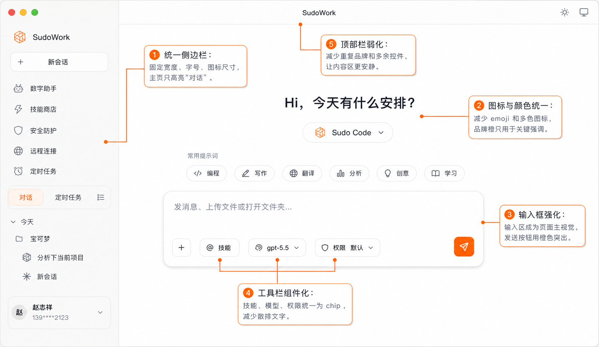
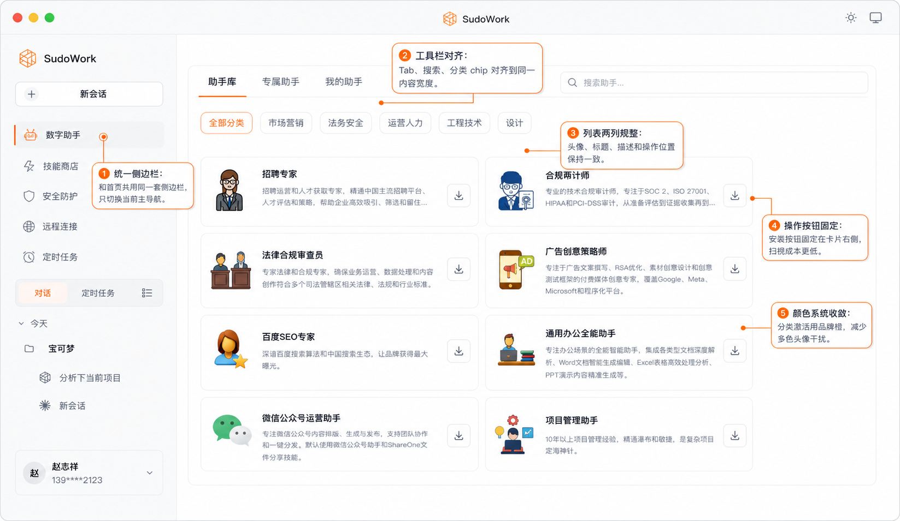
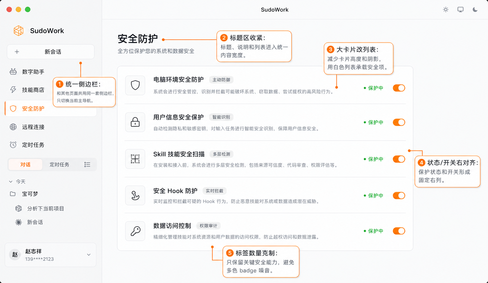
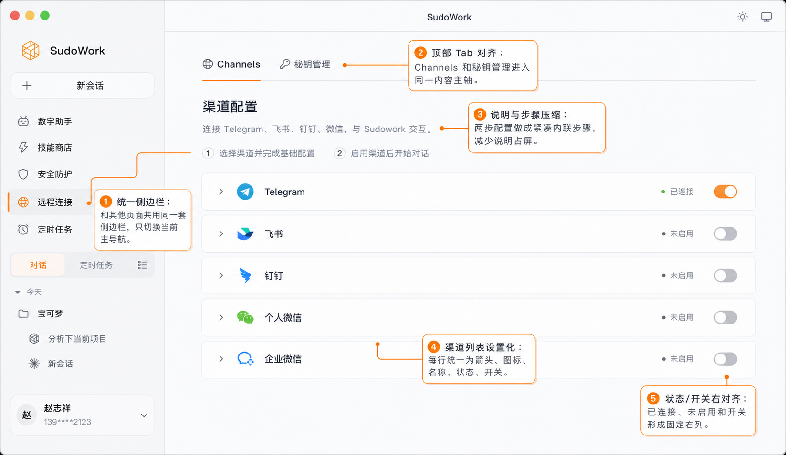
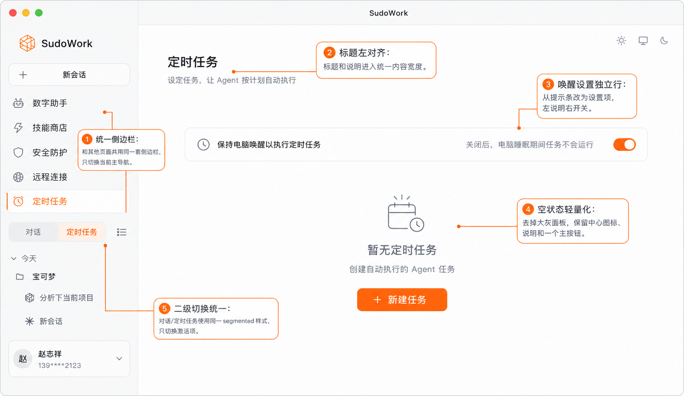

# SudoWork UI 优化方案

本文只讨论 UI 视觉、布局、组件一致性和页面层级，不涉及功能逻辑、信息架构重构或实现方案。

## 参考标注图

本轮使用 Image2 重新生成了一套统一视觉的标注版页面。5 张图共用同一套侧边栏、顶部栏、选中态、项目区、用户卡片和标注样式。

| 页面 | 标注图 |
| --- | --- |
| 首页 |  |
| 数字助手 |  |
| 安全防护 |  |
| 远程连接 |  |
| 定时任务 |  |

## 视觉目标

SudoWork 当前界面整体干净，但组件风格和页面密度不够统一。优化目标是把界面从“功能入口集合”调整成更克制、更稳定的桌面工作台。

核心方向：

- 低噪音：减少多色图标、emoji、大面积灰块和重复按钮。
- 强主轴：所有页面内容进入稳定的内容宽度和对齐体系。
- 统一组件：侧边栏、顶部栏、chip、按钮、列表、开关使用同一视觉语言。
- 明确层级：首页突出输入框；设置类页面突出列表；空状态突出一个主操作。
- 品牌克制：橙色只用于品牌、选中、主按钮和关键状态。

## 当前主要问题

1. 左侧栏视觉重量偏重
   Logo、品牌名、新会话按钮、选中块和用户卡片都较重，主内容区反而被削弱。

2. 选中态不统一
   主导航、二级切换、chip、按钮的激活样式不一致，部分页面使用大面积蓝灰底，和品牌橙没有形成统一系统。

3. 图标语言混杂
   同时出现线性图标、emoji、彩色品牌图标、插画头像，导致界面噪音偏高。

4. 页面内容宽度不稳定
   首页、助手库、安全防护、远程连接、定时任务的内容起点、宽度和垂直节奏不一致。

5. 组件边界不清晰
   输入框、设置行、空状态、列表卡片的样式相互独立，缺少可复用的组件规范。

6. 空状态和设置页偏笨重
   定时任务的大灰色空面板、安全防护的大卡片，都让界面更像后台管理页，而不是轻量桌面应用。

## 全局优化规范

### 1. 侧边栏

侧边栏应作为稳定导航骨架，而不是主要视觉中心。

建议：

- 宽度固定在约 `248-260px`。
- 背景使用浅暖灰，和主内容区通过 `1px` 分割线区分。
- Logo 和品牌名缩小，减少顶部品牌区高度。
- “新会话”按钮保持可见，但降低高度和视觉重量。
- 主导航图标统一为线性图标，尺寸一致。
- 主导航选中态统一为：
  - 白色浅底圆角行
  - 左侧 `2-3px` 橙色竖线
  - 图标和文字改为品牌橙
- 非选中项只使用深灰文字和图标。
- 二级切换统一为 segmented control，不再和主导航抢层级。
- 项目区使用中性项目名，例如“宝可梦”，避免在设计稿中出现临时业务名或 `dota2`。
- 用户信息卡片保留，但降低边框和背景感。

### 2. 顶部栏

顶部栏只承担窗口和少量全局控制，不承担品牌表达。

建议：

- 中间标题 `SudoWork` 保持小字号。
- 左侧保留 macOS 窗口控制。
- 右侧主题、设备等图标统一尺寸和间距。
- 避免顶部栏和侧边栏同时强品牌露出。

### 3. 颜色系统

品牌橙要更集中地使用。

建议：

- 橙色用于：
  - Logo / 品牌符号
  - 当前选中态
  - 主按钮
  - 发送按钮
  - 标注线和编号
- 绿色只用于正向状态，例如“保护中”“已连接”。
- 蓝色、紫色、红色只在确有状态语义时使用。
- 取消大面积蓝灰选中块。
- 页面背景以浅灰和白色为主，避免多层灰色面板叠加。

### 4. 图标系统

建议统一为一套线性图标体系。

规范：

- 主导航图标：单色线性，尺寸一致。
- 工具栏图标：单色线性，和文字 chip 对齐。
- 页面内容图标：允许少量品牌色，但不使用 emoji。
- 助手头像：统一容器尺寸、圆角、背景和插画风格。
- 状态图标和操作图标分开，不混用装饰性图标。

### 5. 按钮与 Chip

按钮和 chip 需要明确分层。

建议定义三类：

- 主按钮：橙底白字，用于当前页面唯一主操作。
- 工具 chip：白底、浅边框、小图标 + 文案。
- 图标按钮：固定宽高，仅用于下载、展开、发送等明确操作。

避免：

- 同一页面出现两个同等级主按钮。
- 文本散排在输入框或列表底部。
- 每个页面单独发明按钮圆角、尺寸和颜色。

### 6. 页面内容主轴

所有页面应使用统一内容宽度。

建议：

- 主内容左边距保持一致。
- 页面标题、说明、工具栏、列表或空状态进入同一内容主轴。
- 首页可居中，但输入框宽度和视觉重心要稳定。
- 设置类页面使用列表承载内容，减少大卡片堆叠。

## 页面级优化

### 首页

目标：让输入框成为页面主视觉。

优化点：

- 主导航不需要高亮具体功能，只高亮二级“对话”。
- 标题“Hi，今天有什么安排？”保留，但不要压过输入框。
- Agent 切换胶囊和提示词 chip 使用统一圆角、边框和图标风格。
- 输入框使用白底、浅边框和轻阴影，成为页面最重要组件。
- placeholder 缩短为“发消息、上传文件或打开文件夹...”。
- 工具项统一为 chip：`+`、`@ 技能`、`gpt-5.5`、`权限 默认`。
- 发送按钮使用品牌橙，状态更明确。

### 数字助手页

目标：提升列表扫描效率。

优化点：

- 选中主导航“数字助手”，侧边栏其他部分保持不变。
- 顶部 `助手库 / 专属助手 / 我的助手`、搜索框、分类 chip 进入同一内容宽度。
- 分类激活态使用品牌橙，不使用蓝色。
- 助手列表使用两列规整布局。
- 每个助手项统一头像、标题、描述和操作按钮位置。
- 下载/安装按钮固定在卡片右侧。
- 减少风格差异大的头像插画，统一头像容器。

### 安全防护页

目标：从后台大卡片改为轻量设置页。

优化点：

- 选中主导航“安全防护”。
- 标题、说明和列表进入统一内容宽度。
- 将多个大卡片改为一个白色设置列表。
- 每行结构固定：图标、标题、能力标签、说明、状态、开关。
- “保护中”和开关右对齐，形成固定右列。
- 标签只保留关键能力，例如“主动防御”“智能识别”“多层检测”。
- 减少彩色标签和大图标块。

### 远程连接页

目标：让渠道配置更像清晰设置列表。

优化点：

- 选中主导航“远程连接”。
- `Channels / 秘钥管理` 顶部 tab 和页面内容对齐。
- 当前 tab 使用细橙色下划线。
- 说明文字压缩，只保留必要范围。
- 两步配置做成紧凑内联步骤。
- 渠道行统一为：展开箭头、渠道图标、名称、状态、开关。
- `已连接 / 未启用` 和开关右对齐。
- 每行高度、边框和间距保持一致。

### 定时任务页

目标：轻量空状态，消除重复操作。

优化点：

- 选中主导航“定时任务”，二级 segmented 也选中“定时任务”。
- 标题和说明左对齐进入统一内容宽度。
- 将“电脑唤醒”从提示条改为设置项：
  - 左侧：说明“保持电脑唤醒以执行定时任务”
  - 右侧：补充说明和开关
- 去掉大面积灰色空面板。
- 空状态只保留中心图标、标题、说明和一个主按钮。
- 删除右上角重复的“新建任务”按钮。

## 优先级

### P0：必须先统一

- 侧边栏组件和选中态。
- 颜色系统，尤其是品牌橙的使用范围。
- 图标风格。
- 二级 segmented control。
- 输入框和按钮/chip 样式。

### P1：页面结构优化

- 首页输入框视觉强化。
- 数字助手列表两列规整。
- 安全防护从大卡片改为设置列表。
- 远程连接渠道行设置化。
- 定时任务空状态轻量化。

### P2：细节体验

- hover / focus / disabled 状态。
- 暗色模式对应规范。
- 列表项 hover、展开、加载状态。
- 窄窗口响应式规则。
- 统一动效时长和缓动。

## 验收标准

1. 5 个页面的侧边栏在宽度、字号、图标尺寸、项目区、用户卡片上完全一致。
2. 任一页面只能有一个主导航选中态。
3. 二级“对话 / 定时任务”切换样式在所有页面一致。
4. 页面主内容的标题和主要区域对齐到同一内容主轴。
5. 橙色只用于品牌、选中、主按钮和关键操作。
6. 首页输入框是视觉最强的组件。
7. 安全防护、远程连接这类设置页不再出现笨重的大卡片堆叠。
8. 定时任务空状态只出现一个“新建任务”主按钮。
9. 页面中不出现 `dota2` 这类临时项目名。
10. 图标风格不混用 emoji、插画、线性图标和多色状态图标。

## 后续落地建议

建议先抽出以下基础组件，再改页面：

- `AppSidebar`
- `SidebarNavItem`
- `SidebarSegmentedControl`
- `TopBar`
- `ActionChip`
- `PrimaryButton`
- `IconButton`
- `SettingsList`
- `SettingsListItem`
- `EmptyState`

这样可以避免每个页面单独调整，导致后续视觉再次分叉。
