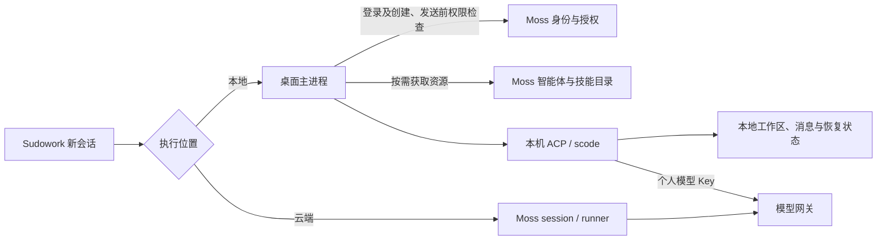

# Moss 管理资源、Sudowork 本地执行：设计与实现

更新日期：2026-09-23。本文已由初始方案更新为当前实现说明，依据 Sudowork `f32b9c6c`、Moss `5056e02` 的源码及实际验证结果。

两个仓库的实现位于 `codex/moss-managed-local-execution`，提交前均已执行 `git rebase origin/dev`：Sudowork 基于 `f0ecf394`，Moss 基于 `d22a84a`。上述提交为本文的功能实现基线。详细测试过程见[实现及验证记录](./2026-09-22-local-cloud-execution-validation.md)。

## 1. 当前行为与执行边界

用户登录 Moss 后，Sudowork 获取服务端执行能力和当前用户的个人模型配置。新用户默认获得 Local 授权，已有用户升级保留旧授权值；组织策略默认允许本地和云端，允许本地时默认选择本地。管理员可以按用户撤销 Local 授权，组织策略也可以限制执行能力或指定默认云端。

| 场景 | 当前行为 |
| --- | --- |
| 管理员新增用户、邀请码注册新用户 | 默认开启 Local 授权；最终能力仍受组织策略约束 |
| 用户登录，允许本地且无特殊默认策略 | 首页默认本地，可选择云端 |
| 用户登录，Local 授权被撤销 | 首页只显示云端执行，不显示本地选项；以云端策略仍允许为前提 |
| 允许本地，但个人凭据或模型尚未就绪 | 本地入口保留，创建时提示准备失败及原因；不自动改成云端任务 |
| 用户在首页切换模式 | 影响之后创建的会话，不改变已有会话的执行位置 |
| 已登录用户在后台被撤销授权 | 下次创建或发送本地会话时重新向 Moss 校验并拒绝执行，包括已缓存的执行器 |
| 管理员恢复授权 | 下次登录或刷新能力后恢复本地选项；旧会话保留原执行位置 |

登录时按服务端 `execution.defaultTarget` 初始化模式；应用恢复时可读取已有选择，并校验本地权限。这里的“默认本地”不表示强制迁移旧会话，也不表示忽略组织设置的默认云端策略。

本地执行的范围是 **Sudowork 桌面端的会话运行、工具调用、工作区、消息存储及恢复状态**。本地会话使用本机 ACP/scode，不创建 Moss session，也不通过 Moss 会话 WebSocket 收发消息。模型请求仍使用个人 Key 访问模型网关；身份认证、执行权限检查及资源目录/下载仍访问 Moss。



当前托管模式采用在线授权检查：即使资源已缓存，Moss 不可达时也不能继续创建或发送托管本地会话。它不提供离线授权宽限期，也没有后台推送撤销后立即中断每个正在执行轮次的承诺。撤销在下一次权限检查时生效。

## 2. Local 授权、密码身份与组织隔离

### 2.1 独立持久化执行权限

旧 `localAuth` 同时被用于密码身份和管理页面的 Local 授权。当前新增独立的执行权限，避免撤销本地执行时影响用户密码登录。

| 字段 | 当前含义 |
| --- | --- |
| 数据库 `users.local_auth` / 用户 `localAuth` | 原有本地认证身份属性，继续保留 |
| 数据库 `users.local_execution_allowed` / 用户 `localExecutionAllowed` | 用户是否获得桌面 Local 执行授权 |
| `execution.isLocalAllowed` | 用户有效状态、用户执行授权和组织策略合成后的本地能力 |
| `execution.isRemoteAllowed` | 组织策略决定的云端能力 |
| `execution.defaultTarget` | 当前有效能力下的默认新会话位置：`local` 或 `remote` |

新用户在数据库创建路径默认写入 `local_execution_allowed=1`，不要求先具有密码身份。管理员添加、邀请码注册，以及其他复用此创建路径的用户均采用这一默认值。

升级规则：

- SQLite 在兼容迁移中新增执行权限列，并一次性从旧 `local_auth` 回填。
- PostgreSQL 新增 v9 迁移，回填旧值后设置默认值 1 和非空约束，不修改旧迁移。
- **新用户默认开启，已有用户保留旧值。** 原来为 false 的旧用户不会因升级统一变为 true；之后需要授权时由管理员明确开启。
- 再次启动或再次执行迁移不会覆盖管理员后续的撤销操作。

### 2.2 管理员范围与兼容接口

管理页面继续使用“Local 授权 / 取消Local授权”，展示状态读取 `localExecutionAllowed ?? localAuth`。调用路径沿用原接口：

```http
PUT /api/v1/users/:userId/local-auth
Content-Type: application/json
Authorization: Bearer <Moss access token>

{"local_auth": false}
```

参数和返回字段保留旧名称以兼容现有管理调用，实际更新的是 `local_execution_allowed`，不再修改密码身份字段。恢复授权时传 `true`。

服务端要求 `admin:users` 权限，并读取数据库中的真实操作者角色和组织：

- 组织管理员 `admin` 角色只能撤销或恢复本组织用户的授权；跨组织目标返回 404。
- 超级管理员 `super_admin` 角色可操作任意组织用户；当前系统的超级管理员账号名为 `admin`，不是依据用户名字符串判定权限。
- 普通用户不能通过伪造 role 或 orgId 调用服务绕过限制。

撤销 Local 不改变云端权限，不修改用户密码、邀请码注册流程或用户组织归属。组织对本地执行的禁止仍优先于单个用户的授权；即使恢复用户 Local 授权，也不能绕过组织限制。

## 3. 已落地的个人模型配置接口

### 3.1 凭据类型与来源

Moss access token 用于平台身份、目录和下载 API；Moss 的 `api_key` 登录凭据用于换取平台 token；`sudorouter_key` 才是本地 scode 使用的个人模型网关 Key。三者用途不同。

Moss 已实现 `buildClientRuntime`，登录响应通过 `attachSudocodeFields` 附加本地运行配置，并提供独立接口：

```http
GET /api/v1/client/local-runtime
Authorization: Bearer <Moss access token>
```

该接口根据已验证的用户与组织构建配置，不接受客户端指定其他 userId 获取凭据。它先检查最新执行权限，再通过 `getUserModelCredential` 获取个人 Key；缺少账号凭据时调用现有 `ensureUserSudorouterAccount` 进行准备。

当前下发范围限定为组织启用的 `legacy-default` 模型 provider，使用个人 Sudorouter Key 发现模型，并过滤 embedding、rerank、语音、图像等非聊天模型。未将个人 Key 自动套用到其他 provider，也不使用组织或系统共享 Key 兜底。登录和运行配置响应设置 `Cache-Control: no-store`。

### 3.2 实际响应契约

以下是就绪响应的结构示例，示例值不包含真实凭据：

```json
{
  "execution": {
    "isLocalAllowed": true,
    "isRemoteAllowed": true,
    "defaultTarget": "local"
  },
  "localRuntime": {
    "userId": "<current-user-id>",
    "organizationId": "<current-organization-id>",
    "status": "ready",
    "protocol": "openai-responses"
  },
  "sudorouter_key": "<personal-model-key>",
  "model_service_url": "https://model-gateway.example/v1",
  "models": ["gpt-5.4"],
  "scode_auto_model": "gpt-5.4"
}
```

`protocol` 支持 `openai-completions`、`openai-responses`、`anthropic-messages`，具体值来自 provider。当前契约没有额外的协议版本号、凭据到期时间或统一资源目录版本字段。

| `localRuntime.status` | 含义与行为 |
| --- | --- |
| `ready` | 个人 Key、provider 和聊天模型已准备好；不代表所选智能体、技能和本机运行依赖全部检查完毕 |
| `policy_denied` | 用户未获有效 Local 授权或组织禁止本地执行；不下发个人 Key，本地入口隐藏 |
| `credential_pending` | 个人凭据缺失或账号准备失败；保持原执行能力，使用前可再次尝试准备 |
| `provider_unavailable` | 没有启用的受支持 provider |
| `models_unavailable` | 没有发现可用聊天模型，或模型发现失败 |

非 ready 响应包含执行能力、身份与状态，`models` 为空，不附带个人 Key。桌面用 Zod 校验响应边界。新托管登录路径在主进程应用凭据，传给 renderer 的登录结果移除 Key 和模型服务地址，保留执行能力、状态与模型列表。连接旧 Moss、未返回新契约时，客户端仍保留原兼容分支；不能把旧分支当成已具备新版全部授权行为。

## 4. 桌面初始化、凭据刷新与撤销检查

`mossLocalRuntime.ts` 负责托管配置生命周期：

1. 以标准化 Moss 地址、organizationId、userId 的组合计算 SHA-256，作为 `mossAccountScope`。
2. 首次进入托管身份时备份原 scode 配置到 `.before-moss` 文件，备份文件权限为 0600。
3. 根据个人 Key、endpoint、协议和模型列表生成 scode 配置，同步 Nexus 凭据。相同身份刷新时保留仍有效的已选默认模型。
4. 登录、token 刷新响应以及独立运行配置请求应用最新状态；相同配置用摘要避免重复写入，但本地执行前仍会向服务端检查权限。
5. 切换身份时清理旧执行器；相同身份撤销权限、配置未就绪或 Key/endpoint 变化时，只清理本地执行器，保留云端连接。
6. 退出托管身份时清理执行器，恢复进入托管前的 scode 配置，并同步清理或恢复 Nexus 凭据。

异步配置准备在应用响应前校验 token 和服务器地址，资源准备也检查当前身份，避免切换账号后写入旧请求的结果。当前共享 scode 配置只支持一个活跃托管身份。

Local 权限检查覆盖普通会话创建、执行器获取/重建以及 ACP 发送入口。`WorkerManage` 在返回缓存任务前也检查权限，不能仅凭旧的 ready 状态继续本地执行。网络失败、未授权或未就绪时会拒绝操作，不回退到其他用户或共享凭据。

创建托管本地会话时，还会调用 `ensureScodeInstalled` 准备本机引擎，再准备所选资源；引擎不可用时返回错误，不创建该会话。因此服务端返回 `ready` 只完成了模型配置准备，不替代桌面引擎与资源检查。

创建会话使用显式 IPC 错误响应 `{ "__error": "..." }`，调用方识别后显示错误、结束准备提示并保留草稿。这解决了 provider 直接抛错时 renderer 长时间停留在“正在准备”的问题。当前没有独立的完整资源状态管理页面或通用模型 401 自动重试机制。

## 5. 会话归属与按会话路由

当前实际持久化的是会话 `extra` 中的以下字段，并复用既有会话类型、引擎和恢复字段：

| 字段 | 用途 |
| --- | --- |
| `executionTarget` | 固定会话的 `local` / `remote` 执行位置 |
| `mossAccountScope` | 绑定创建时的 Moss 地址、组织和用户 |
| `mossResources[]` | 所用资源的 `id`、`kind`、`digest`、本地 `path` |
| `backend`、`workspace` 等既有字段 | 本地引擎、工作目录及相关运行配置；本轮托管本地使用 scode |
| `mossSessionId` 等既有云端字段 | 关联 Moss 会话及云端恢复 |

本地新会话使用 `type=acp`、`backend=scode`；云端使用 `remote-agent`。`extra.sessionMode` 继续承担 ACP 权限/工作模式，不用于替代 `executionTarget`。

`resolveConversationExecutionTarget` 优先读取显式执行位置，缺少新字段的旧记录再根据 `remote-agent` 类型或 backend 推断。已有会话通过 `getProviderForConversation` 检查账号归属后选择 provider，读取、更新、删除、消息同步及恢复均沿会话本身的执行位置处理，不依赖首页当前模式。

托管历史按当前 `mossAccountScope` 过滤。缺少归属字段的旧云端记录，只有在 Moss 确认 session 属于当前用户和组织、服务器地址也匹配后才补写归属；无法确认时保留原数据，不自动分配给当前账号。已有本地或其他身份记录也不会因为登录而批量改归属。

## 6. 智能体和技能的按需准备

现有登录后的资源同步仍保留，但托管本地会话另有 `prepareMossResources` 作为使用前的准备入口，不把后台同步完成等同于资源就绪。

当前流程：

1. 根据所选智能体和技能，获取当前身份可见的 `/api/v1/agents/installed`、`/api/v1/skills/installed` 目录；资源必须能唯一解析且未被禁用。
2. 下载 `/api/v1/{agents|skills}/installed/:id/download`，核对响应的 `X-Content-SHA256` 与 ZIP 内容摘要。
3. 智能体读取规则文件，并收集目录及元数据中的 `enabledSkills` / `skills` 依赖；准备所选技能和声明的技能依赖。
4. 检查包体、解压条目和已声明的云端依赖，在临时目录解包，完成后原子发布到带内容摘要的目录。
5. 保存 `mossResources`，把规则上下文和技能路径交给本机 scode。托管本地预设会话跳过原有 Dify 会话绑定。
6. 在后续工作区技能同步/发送准备中检查资源当前可见性与快照标记；运行中新增技能也走相同准备流程，再追加到会话快照。

资源缓存位于应用数据目录 `managed/<accountScope>/skills` 或 `assistants` 下的对应分类目录。版本目录由安全化名称和摘要前 16 位组成，快照记录完整 SHA-256。不同身份使用不同目录，同一资源的新内容使用新目录，已有会话保留原版本引用。

已实现的下载与安装检查：

- ZIP 最大 50 MiB，解压后累计最大 200 MiB，最多 5000 个文件条目。
- 拒绝绝对路径、父目录跳转、Windows 盘符路径及 ZIP 中的符号链接。
- 技能必须有 `SKILL.md`，智能体必须能找到规则文件；保留脚本可执行权限。
- 临时目录完整准备后再发布，以 `.moss-ready` 记录摘要，失败时清理临时目录。
- Moss 的资源 ZIP 输出固定时间戳与排序，使相同内容的摘要稳定；下载继续复用服务端组织和资源可见性检查。

边界需要区分：恢复时校验的是当前可见性、本地路径范围和 `.moss-ready` 中的摘要标记，**没有对解压后的每个文件重新计算内容摘要**。当前也没有按会话引用计数自动回收旧版本；资源准备仍会请求目录并下载 ZIP 来确认内容，不是完全跳过网络的缓存命中。旧同步器没有整体重写，任意资源来源、任意依赖图也不能据此宣称已通用支持。

## 7. 当前支持范围与后续适配

| 能力 | 当前状态 |
| --- | --- |
| 普通 scode 会话、本地消息与工作区、重启续聊 | 已实现并实测 |
| 规则、技能说明、模板、参考文件和脚本的下载 | 已实现；测试智能体及技能已在本机生成文件 |
| 显式声明 workflow、enabledMcpServers、enabledWikis、enabledCorpApps 的资源 | 当前准备流程拒绝并提示需要云端服务 |
| 任意 Node/Python/二进制依赖和操作系统兼容性 | 未建立通用检测、安装与版本约束机制；成功解包不等于运行依赖齐备 |
| 本机/远程 MCP、wiki、企业应用、共享记忆和服务端工作流 | 仍需逐项适配，不能仅凭 ZIP 下载获得 Moss runner 的上下文和凭据 |
| 递归子智能体依赖与完整资源依赖图 | 未建立通用准备契约 |
| 离线继续执行与即时撤销推送 | 当前未实现；创建和发送前在线检查 |
| 定时任务和 WebUI 本地执行 | 不属于本轮会话改造的验收范围，不能由桌面默认本地推断其执行位置已改变 |

Moss 服务端注入的 session token、wiki、企业应用和 MCP 凭据不会自动迁移到桌面。元数据检查也不是任意脚本行为分析，不能承诺所有未声明依赖的资源都可完全本地运行。

个人网关 Key 继续受网关自身的额度机制约束；本轮没有新增本地用量上报、部门预算等同强制执行或统一账务对账机制。撤销 Local 约束的是托管桌面执行流程，不等于撤销已经复制到桌面外使用的个人模型 Key，也不删除用户已经下载的资源或工作文件。

## 8. 验证结果与源码入口

用户已确认本地与云端测试通过。已完成的实机验证包括：密码登录默认本地、本地和云端真实模型回复、首页切换模式后原会话继续执行、重启恢复、智能体/技能首次下载并生成本地文件、退出后的凭据恢复，以及旧云端记录归属兼容。

逐用户授权验证包括：管理员新增用户默认授权、组织管理员本组织撤销成功/跨组织拒绝、超级管理员跨组织撤销和恢复、旧 token 在撤销后不能获取本地凭据、撤销后密码登录正常、真实桌面仅显示云端、恢复后重新显示两个选项，以及邀请码注册默认授权并归属正确组织。

| 检查 | 最近结果 |
| --- | --- |
| Sudowork 全量测试 | 2591 通过、11 跳过 |
| Moss rebase 后全量测试 | 1215 通过、7 跳过；保留 runner 原有两个排除文件 |
| PostgreSQL 16 独立迁移测试 | 34 项通过，含默认授权、保留旧值及重复迁移 |
| Sudowork desktop / renderer 类型检查 | `tsc --noEmit` 通过 |
| Moss Node / 管理页面构建 | 通过 |
| Moss 类型基线检查 | 通过；server 105 条、基线 112 条，其他区域 1337 条，不是全仓零类型错误 |

实机模型验证使用 `gpt-5.4`。短信、OAuth 等外部认证方式没有在本测试环境逐一实测；新建测试组织的邀请码注册证明了归属与默认授权，不代表该组织未配置的模型服务也已可用。完整证据与环境限制见[验证记录](./2026-09-22-local-cloud-execution-validation.md)。

主要源码入口：

| 范围 | 文件 |
| --- | --- |
| Moss 执行能力、个人 Key 与状态契约 | [clientRuntime.ts](https://github.com/sudoprivacy/moss/blob/5056e02/src/server/clientRuntime.ts) |
| Moss 登录、运行配置及 Local 管理路由 | [server.ts](https://github.com/sudoprivacy/moss/blob/5056e02/src/server/server.ts) |
| 管理员范围及实时用户授权检查 | [auth/service.ts](https://github.com/sudoprivacy/moss/blob/5056e02/src/server/auth/service.ts) |
| 用户默认值、SQLite 与 PostgreSQL 迁移 | [authCenter/db.ts](https://github.com/sudoprivacy/moss/blob/5056e02/src/server/authCenter/db.ts)、[pg_schema.ts](https://github.com/sudoprivacy/moss/blob/5056e02/src/server/db/pg_schema.ts) |
| Local 授权管理页面 | [users-page.tsx](https://github.com/sudoprivacy/moss/blob/5056e02/admin/src/pages/users-page.tsx) |
| 桌面执行能力和会话扩展类型 | [mossExecution.ts](https://github.com/sudoprivacy/sudowork/blob/f32b9c6c/packages/common/src/mossExecution.ts) |
| 主进程登录、刷新与凭据应用 | [eeclawBridge.ts](https://github.com/sudoprivacy/sudowork/blob/f32b9c6c/apps/desktop/src/process/bridge/eeclawBridge.ts)、[mossLocalRuntime.ts](https://github.com/sudoprivacy/sudowork/blob/f32b9c6c/apps/desktop/src/process/services/mossLocalRuntime.ts) |
| 界面能力及默认模式 | [AuthContext.tsx](https://github.com/sudoprivacy/sudowork/blob/f32b9c6c/packages/renderer/src/context/AuthContext.tsx)、[useGuidAgentSelection.ts](https://github.com/sudoprivacy/sudowork/blob/f32b9c6c/packages/renderer/src/pages/guid/hooks/useGuidAgentSelection.ts) |
| 会话归属和 provider 选择 | [mossExecutionContext.ts](https://github.com/sudoprivacy/sudowork/blob/f32b9c6c/apps/desktop/src/process/services/mossExecutionContext.ts)、[providers/index.ts](https://github.com/sudoprivacy/sudowork/blob/f32b9c6c/apps/desktop/src/process/providers/index.ts) |
| 创建、资源准备和发送入口 | [conversationBridge.ts](https://github.com/sudoprivacy/sudowork/blob/f32b9c6c/apps/desktop/src/process/bridge/conversationBridge.ts)、[mossResourcePreparation.ts](https://github.com/sudoprivacy/sudowork/blob/f32b9c6c/apps/desktop/src/process/services/mossResourcePreparation.ts) |
| 已缓存执行器及 ACP 发送授权 | [WorkerManage.ts](https://github.com/sudoprivacy/sudowork/blob/f32b9c6c/apps/desktop/src/process/WorkerManage.ts)、[AcpAgent.ts](https://github.com/sudoprivacy/sudowork/blob/f32b9c6c/apps/desktop/src/process/task/AcpAgent.ts) |

本轮文档描述上述已提交实现；原始方案中尚未落地的通用依赖管理、离线授权、复杂云端能力本地适配等事项，统一保留在第 7 节，不再作为已完成能力描述。
