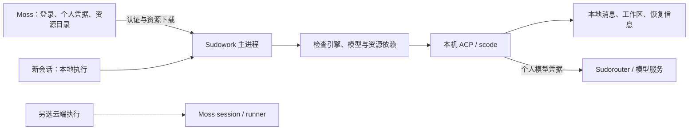

# Moss 管理资源、Sudowork 本地执行：设计分析

日期：2026-09-22。依据本地 Sudowork `f0ecf394`、Moss `11c7571` 的源码分析；未连接实际部署验证登录响应、未修改业务代码。

## 结论与边界

方案可行，而且已有本地 ACP/scode 会话、登录下发模型配置、云端资源下载的基础。主要工作是把这些能力连接成可靠的默认本地执行流程。

本文按“桌面端新会话默认本地执行，保留云端执行选项”设计；用户已有会话保持原执行位置。已有明确选择可以按用户记忆，不能因为重新登录而迁移会话。

需要区分三个独立概念：

- 账号、组织、模型额度和资源目录由 Moss 管理。
- 本地会话由 Sudowork 主进程与本机 scode 执行，消息、工作区、运行状态和恢复信息保存在本机；不创建 Moss session。
- 模型推理可以继续调用 Sudorouter/模型服务。发送给模型的上下文仍会离开本机，因此这是“本地执行”，不是“完全离线”或“所有数据不出本机”。

如果要求登录和下载之后也完全不访问 Moss，需要排除或替代依赖 Moss 知识库、企业应用、服务端工作流和远程 MCP 的资源。第一阶段应明确支持哪些能力。

## 1. 已有实现与真正缺口

| 方面 | 当前源码事实 | 对方案的影响 |
| --- | --- | --- |
| 本地入口 | `AgentPillBar.tsx:41` 已支持云端/本地切换 | 不是从零增加按钮 |
| 本地可用判断 | `AuthContext.tsx:1598`、`eeclawBridge.ts:352` 判断 `user.localAuth && sudorouter_key && model_service_url && 非空 models` | 截图只有云端，按当前代码说明本地能力未被判定可用；无法仅凭截图确定哪个条件缺失 |
| 默认模式 | `useGuidAgentSelection.ts:288`、`enterpriseDebugConfig.ts:71` 缺省为 remote | 登录配置完成、主进程缓存、首页状态需一致地初始化 |
| 模型配置 | `AuthContext.tsx:1614` 生成 scode 配置，`scodeBridge.ts:277` 写入 | 可复用，但不能把保存失败仍算本地就绪 |
| 本地会话 | `useGuidSend.ts:278` 创建 `acp`，传 `sessionModeParam: local`；`LocalConversationProvider.ts:35` 使用本地会话服务 | 已具备本地 SQLite、WorkerManage、AcpAgent 链路 |
| 本机 scode | `AcpAgent.ts:451` 支持本机 nexusd-cluster 管理进程；`AcpConnection.ts:288` 支持 tunnel，失败回本机 spawn | 两条本机执行路径可继续使用 |
| 用户模型 Key | Moss `auth/service.ts:1992` 已有 `getUserModelCredential(userId)`，可从账号服务或旧库读取 | 不需要重新建设整套用户网关账号系统 |
| 登录下发 Key | Moss `server.ts:1041` 的 `attachSudocodeFields` 仍返回 `settings.apiKey` | 当前下发的是组织/系统配置 Key，不是上述用户专属 Key |
| 可用模型 | Moss `server.ts:7042` 已有 `/api/v1/models/available`，按组织和用户凭据发现模型 | 可复用，但需要保留 provider、协议、端点和凭据边界 |
| 资源同步 | `eeclawBridge.ts:384` 登录后后台调用 `syncAllFromRemote`；Moss 已有 installed/tenant 下载接口 | 不缺基本下载能力，缺少使用前依赖检查及版本管理 |
| 资源授权 | Moss `server.ts:3506` 统一进入 `withOrganizationResources`，目录查询进一步按可见性过滤 | 复用现有鉴权上下文，不要绕过它另建公共下载通道 |

以上 Sudowork 路径分别位于 `packages/renderer/src/`、`apps/desktop/src/`；Moss 路径位于 `src/server/`。当前是 monorepo，旧文档中的顶层 `src/renderer` 路径不能直接用于实施。

## 2. “用户 API Key”必须明确指模型凭据

Moss 的 API Key 登录和模型调用不是同一个体系：

- Moss `api_key` 用于换取 Moss access token、访问平台 API。`authCenter/db.ts:2058` 创建时返回一次明文，库内保存 secret hash，不能在登录后把旧 Key 明文重新取出来。
- `sudorouter_key` 是模型网关凭据，本地 scode 需要它对应的 endpoint、协议和模型列表。
- Moss access token 用于身份和资源 API，不应直接当作模型服务 Key 使用。

建议登录成功后，由桌面主进程获取当前身份的本地运行配置：

1. Moss 从已验证 access token 得到用户与组织，不接受客户端任意指定 userId 来取 Key。
2. 调用已有 `getUserModelCredential`；如未开户，复用账号服务进行幂等准备。
3. 返回当前用户可使用的模型路由与个人凭据；缺少个人凭据时返回可重试的准备状态。
4. 不自动下发系统/组织共享 Key 兜底。确有共享模型的私有部署，应提供专门允许客户端使用的受限凭据或模型代理。
5. 普通客户端不能依赖 `/users/:id/sudorouter-key/copy`：现有接口需要 `admin:users`，适用于管理用途。

最小兼容改造可以修正 `attachSudocodeFields` 的凭据来源，暂时保留原字段。推荐最终提供独立的本地运行配置接口，例如 **拟新增** `GET /api/v1/client/local-runtime`，使密码、验证码、API Key、OAuth 和恢复登录都使用同一条初始化链路。该 URL 是设计建议，当前并不存在这一完整契约。

该配置至少包含：协议版本、server/org/user 身份、允许的执行位置、默认位置、模型 provider/协议/baseUrl/模型列表、凭据状态或有效期、资源目录版本。凭据通过受认证接口提供给主进程，响应禁止缓存；渲染层只拿可用状态、模型标签和错误原因。

不能把所有 provider 都配上用户 Sudorouter Key。Moss `runtimeService.ts:2176` 已区分 legacy provider 的个人网关凭据与其他 provider 凭据。第一阶段可限定已验证的 Sudorouter 路由，再扩展可下发的其他 provider。

## 3. 将执行权限与密码身份拆开

当前 `localAuth` 存在语义混用：

- Moss `identity/unifiedIdentityService.ts:161` 按 `hasLocalPassword` 设置它。
- Moss 管理界面又把它显示为“Local 授权”。
- Sudowork 用它决定是否展示本地执行。

因此不能简单把所有用户的 `localAuth` 批量设为 true 来实现默认本地。那会把身份认证属性和执行权限继续绑在一起，验证码/SSO 用户尤其容易出现不一致。

建议独立表示：

```text
身份：serverId + organizationId + userId
执行能力：allowedExecutionTargets = [local, remote]
默认执行：defaultExecutionTarget = local
本地状态：preparing / ready / unavailable
失败原因：credential_pending / engine_missing / resource_missing / policy_denied
```

权限允许不等于机器已经准备好。能力由服务端政策决定；运行就绪由桌面主进程根据引擎、模型配置和选定资源判断。组织无特殊限制时可默认开放本地，升级旧策略时应明确保留已有禁止规则。

本地初始化失败应保留“本地执行”及具体原因和重试入口。不能把用户已经选择的本地任务悄悄改成云端任务。

## 4. 会话执行位置固定，首页选择只影响新会话

建议会话至少记录：`executionTarget`、`engine`、`ownerScope`、`workspace`、`modelProviderId`、`resourceSnapshotId`，本地会话另存 ACP 恢复标识，云端会话另存 Moss session ID。

本地流程：



本地会话不调用 Moss session create/send/resume，也不建立 Moss 会话 WebSocket。Moss 的认证、模型目录及资源下载 API 可以继续使用。

当前创建已传入执行模式，但 `conversationBridge.ts:495/527` 的更新、获取以及 `databaseBridge.ts:16` 的消息读取仍使用无参数 provider，即依赖全局当前模式。应统一改为根据会话持久化的执行位置路由。否则首页切换云端/本地后，旧会话的获取和更新可能走错 provider。

`extra.sessionMode` 在现有 ACP 流程还承载权限/工作模式，不宜继续用它混装执行位置。可在边界兼容旧 `sessionModeParam`，内部使用含义明确的字段。

历史云端会话继续在云端恢复；可明确“复制上下文为本地新会话”，但不要直接修改原记录的执行位置。服务器的进程状态、路径、工具权限和文件并不会随一个字段迁移。

## 5. 资源下载改成“按需准备 + 会话快照”

建议登录只加载可见资源目录与必要默认资源；用户选择智能体或技能后，提前下载依赖；第一次使用前由主进程执行 `ensureResourcesReady`。用户在运行中新增技能，也经过同一个准备服务，完成后再注入后续模型轮次。

资源状态应明确为：可见、未下载、下载中、可用、更新可用、不兼容、失败。目录可见性、已缓存、本地启用和运行就绪是不同状态。

准备内容不只是一份 Markdown：智能体规则、依赖技能、脚本、模板、参考文件、所需 Node/Python/二进制、平台要求、MCP 配置及授权方式均需检查。资源元数据至少包含稳定 ID、版本、内容摘要、依赖、兼容执行位置及最低引擎版本。

现有同步需要补齐：

- `remoteToLocalSync.ts:1067/1143/1255/1318` 按 ID 存在即跳过，不能识别同 ID 的规则/版本变化。改为比较版本与摘要，不能只比安装 ID。
- `syncAllFromRemote` 的某一类列表请求失败会被转换成空结果；完成事件不能直接代表依赖已就绪。必须保留分项错误，使用前验证文件和快照完整性。
- 当前技能主同步只取 `isHubInstalled`，另有 tenant 同步；Moss 自定义技能仍要补齐明确的同步/导出支持，不能假设所有 installed 资源均已落到本机。
- `installSkillById` 会写 `enabled: true`，按需流程必须保留服务端和本地允许的启用状态。
- `installAssistantById` 缺省写入 `presetAgentType: claude`，而当前本地入口偏向 scode；普通可兼容智能体应明确映射到 scode，特定引擎依赖应标注，不要靠缺省值或自动回退。
- ID 下载安装路径需要使用对应摘要校验；当前旧 sourceUrl 安装流程有 checksum 验证，新 ID 流程未做同样校验。已有 ZIP 路径校验应保留。
- 安装应先下载到临时目录、校验、完整解包，再原子切换；当前先删除旧目录再解包，失败会留下不完整资源。

缓存按 server/org/user 和 resource ID/version 分区。会话引用固定版本，运行中的资源不能被后台同步删除或覆盖；无引用旧版本再清理。Moss 自己已有 `catalog/organizationResources.ts:209` 的会话资源快照设计，可对齐资源身份和撤销语义。

本地资源准备由主进程或受控工具完成，避免让模型持有 Moss 平台凭据自行拼接下载 URL。

## 6. 不是所有云端智能体都能直接本地化

| 资源/依赖 | 第一阶段建议 |
| --- | --- |
| 规则、技能说明、模板、参考文档 | 支持下载后本地使用 |
| 脚本与本机工具 | 先检查操作系统、运行时、依赖与文件权限，再执行 |
| 子智能体 | 同样检查其规则和技能依赖，固定版本；本机派生 |
| 本机 MCP | 配置及可在客户端使用的授权准备完成后可支持 |
| 远程 MCP、Moss wiki、企业应用 | 若继续调用，标明外部依赖；若要求不访问 Moss，需本地适配或禁用该能力 |
| 服务端 workflow、共享记忆、事件触发器 | 单独迁移执行语义，不应当作普通 ZIP 资源即插即用 |

Moss `runtimeService.ts:1816` 附近会处理 wiki、企业应用和 session token，`1958` 附近会解析 MCP 凭据；这些服务端运行上下文不会随智能体 ZIP 自动出现在本机。

Sudowork 的本地预设会话还会尝试绑定 Dify 增强（`useGuidSend.ts:307`、`shared/dify/sessionBinding.ts`）。这不代表必然产生外部请求，但“本地执行”产品契约必须明确这些增强是否允许，不能仅检查没有 Moss session 就宣称所有处理都在本机。

## 7. 身份、凭据与用量生命周期

本地化引入的关键问题是同一台电脑切换账号：

- 现有资源目录为共享的 `~/.nexus/skills`、`~/.nexus/assistants`，没有 Moss 地址/组织/用户维度。
- 本地数据库默认用户是 `system_default_user`（`database/index.ts:98`），不能当作已经按 Moss 用户隔离历史。
- scode 使用共享 `~/.nexus/sudocode` 配置；`scodeBridge.ts` 已设置非 Windows 文件权限 0600，同时把个人 Key 镜像到 Nexus。
- `authProxy/userKeySync.ts:33` 遇到缺失字段会跳过，而不会删除旧 Nexus Key，因此只把 scode 配置清空不足以证明所有凭据都已注销。

建议给托管账号、资源和历史增加身份分区；切换账号时结束/隔离旧身份运行实例，避免会话续跑使用新用户的 Key。退出时清理相关凭据与缓存引用，历史会话保持归属，不自动删除用户工作文件。

保留 scode 当前共享配置模型，使用已支持的账号选择或项目覆盖机制做隔离；如果现有契约不足，再显式扩展会话凭据注入。不要简单新建一套全局 config home，导致独立 scode 与桌面引擎配置再次分叉。若暂时只能安全支持单一活跃身份，应在第一阶段明确这一约束。

access token 刷新与模型凭据刷新要统一编排。当前 `eeclawBridge` 的 refresh 主要持久化身份 token，没有把新模型配置完整应用到 scode。模型 Key 轮换或失效时应重新拉取当前身份配置，再重试一次可重试调用；不能用其他身份或共享 Key 兜底。

个人网关 Key 可用于网关已有额度扣减，但 Moss 的会话/用户/部门预算规则不一定自动覆盖本地执行。需要核对网关实际执行哪些限额。客户端上报用量可以做展示和对账，不能单独作为强制限额依据；强制限额必须由模型网关或必要的模型代理执行。此代理即使存在，也不需要成为 Moss 会话执行器。

权限撤销可在在线刷新和下次使用时检查，但已经下载到用户电脑的文件无法保证离线远程撤回。需在“允许断开 Moss 后继续使用”和“立即执行所有撤销策略”之间明确产品政策。

## 8. 推荐实施顺序与验收

1. **基础本地会话闭环**：拆分执行能力与 localAuth；接通个人模型凭据；统一主进程初始化；新会话默认本地；修正 provider 路由与账号归属。先验证普通 scode 会话。
2. **智能体/技能闭环**：复用现有下载服务，补依赖检查、摘要、版本缓存、原子安装和会话快照；支持规则及脚本型智能体。所选资源不可用时给出原因。
3. **复杂能力适配**：逐项支持 MCP、wiki、企业应用、子智能体及 workflow；再评估定时任务。当前企业定时任务页面仍偏向 remote，不能认为会话默认本地会自动改变定时任务执行位置。

最小验收集：

- 密码、验证码、API Key、OAuth 登录及恢复登录均得到一致的执行能力；当前用户 Key 缺失时不下发共享 Key。
- 创建本地会话到停止、重启、恢复全过程不调用 Moss session API/会话 WebSocket；scode 进程和 workspace 确认位于本机。
- 模型调用使用当前用户的正确 provider 凭据；401、Key 轮换、无模型、引擎缺失都可解释和恢复。
- 无缓存首次使用智能体、运行中新增技能、下载失败、同 ID 更新、平台不兼容均有正确状态；失败不留下可执行的半包。
- 首页切换模式不改变旧会话的获取、更新、删除、读取消息和恢复位置。
- 切换账号/组织/Moss 地址后，不显示另一身份的历史、不使用另一身份的资源授权和 Key；已有运行实例不串号。
- 已缓存的纯本地资源，在 Moss 不可达而模型网关可达时是否允许继续执行，符合所选择的授权有效期政策。
- 本地资源授权、模型扣费和云端会话保持现有正确行为；WebUI 没有本机 agent 桥接时继续使用云端，不把“本地”错误解释成 WebUI 服务器。

本轮只完成设计分析，未执行运行时测试，也未触发真实模型请求、登录或资源下载。已有 `docs/enterprise-local-moss-integration-plan.md` 中的注册、充值及旧服务迁移属于更大范围，且部分现状描述已落后于代码，不能作为本轮必须一并实现的依赖。
