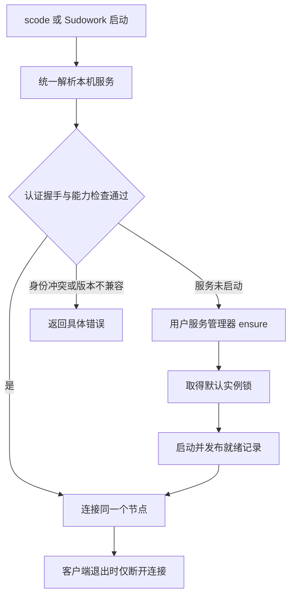

# Agent Move：共享本机 Nexus 与显式内容复制

状态：设计讨论稿，更新于 2026-10-07。已补查复制复用路径、scode core tools、Nexus 在线挂载边界与 Moss API；实施了模板页面的命名修正。未实施存储迁移、daemon 替换或生产部署。

## 1. 已对齐的契约

按用户本轮指示及 ShareOne 存储矩阵，保留 flat + link：

```text
/agents/<agent-name>/
  config / prompts / skills / memory
  sessions/<sid> -> /sessions/<sid>/
/sessions/<sid>/
  transcript.jsonl
  tool-results/...
/proc/<pid>/                  单次运行的临时状态
```

- Agent 是属于一个人的持久实例；模板是共享定义。
- agent-name、durable session-id、pid 是三个不同标识。
- `/agents` 是访问 Agent 的入口；同步范围包含它引用且属于此次迁移的持久对象。
- `/sessions/<sid>` 继续是会话正文的唯一存储位置，不将正文搬进 agent 目录，也不复制成第二份主数据。
- standalone 与 cohost 对齐同一逻辑目录和读写契约，运行方式可以不同。
- 默认继续 local write + remote fetch。显式内容复制是用户要求保存到云端或带到另一台机器时增加的操作。
- Sudocode 写 Agent 状态；Sudowork 写自身界面状态，通过引擎调用 Agent 能力。

上一版提出实体嵌套 session 的建议已撤回。完整性应由引用解析和内容复制保证。

## 2. 已核查事实

矩阵通过用户指定的 ShareOne skill `download_share.js` 下载，未修改线上文档。

| 核查项           | 结果                                                                                                                                    |
| ---------------- | --------------------------------------------------------------------------------------------------------------------------------------- |
| 矩阵 Q1/Q6/Q9    | flat session 存储、Agent 链接索引；链接目标须在已挂载命名空间内；Sudowork 委派给引擎                                                    |
| standalone 会话  | `engine-host/session.rs` 显式构造本机 `SessionStore::from_cwd`；连接 A2A daemon 不会自动改变会话存储                                    |
| standalone A2A   | 已通过 `NEXUS_A2A_ENDPOINT` 和 Agent credential 连接 daemon，可复用连接/身份基础                                                        |
| gRPC FsBackend   | 已有 read/write/link/stream 接口；尚未装配为共享会话存储。当前 `is_append_stream` 只识别会话通信路径，不能直接套用于 session transcript |
| Sudowork daemon  | `DynamicNexusVfsService` 使用 `~/.nexus-vfs/data`；start/stop 会清理固定端口进程，生命周期属于 Electron 子进程                          |
| 普通内容远端读取 | `try_remote_fetch` 返回远端字节，不持久回写；这是现有读取契约                                                                           |
| 冷会话片段       | `read_cold_segment` 本地缺失时去记录的 origin 读取                                                                                      |
| 部分 CAS chunk   | 有专用校验/缓存路径，但不是整组内容的持久复制与确认接口                                                                                 |
| 主动复制任务     | Nexus #2741 仍 open，提出写后异步复制；它不是已交付的 cluster 能力                                                                      |
| 当前 RPC         | 有 `ReadBlob`、元数据复制、流读写；此次未找到通用内容复制、持久副本确认和 Agent 同步任务接口                                            |

源码基线：Nexus VFS `77f1241de`；Python Nexus `bc48b7c1d`；Sudocode `213ad227`；Sudowork `ce47b297`；Moss `fd027ca`。这些是源码结论，尚未进行目标发布二进制的三机验收。

另有进行中的 ACP mailbox 联合变更（Nexus VFS #380、Sudocode #854、Moss #321、Sudowork #1190）。本方案不另建运行时通信协议；实现时需协调版本，不能把 draft 能力算成已发布能力。

## 3. 本机共享 nexusd-cluster

### 作用域与职责

默认每个 OS 用户一个本机节点，所有工作区、CLI 窗口和 Sudowork 复用。多组织身份通过认证上下文和 zone 隔离，不按工作区启动多个节点。不同 OS 用户拥有独立状态目录和服务。

建议由 Nexus 提供统一跨平台服务管理入口。下面是拟定语义，尚不是现有命令：

- `ensure`：发现、验证并返回同一个服务；必要时由服务管理器启动。
- `status`：返回节点标识、版本、能力、实际端点和启动状态。
- `stop/upgrade`：显式管理动作，考虑活跃使用者；普通客户端退出不调用。

scode 和 Sudowork 均调用同一入口。LLM 无需判断是否已有 daemon，也无需编写启动脚本。

### 启动与连接

1. 显式指定端点时，只连接并验证该端点；失败不自行另起实例。
2. 默认读取用户级服务发现记录，位置独立于 cwd、项目配置目录和 worktree。
3. 用真实 RPC 核对节点身份、实例启动标识和能力；端口开放或 PID 存在不足以证明可复用。
4. 服务未启动时，管理器调用 OS 用户服务。并发请求汇聚到同一个服务名。
5. daemon 在打开数据库和监听前取得用户级实例锁，并持有至退出。OS 服务名约束、实例锁和数据库锁分层兜底。
6. 就绪后原子写入发现记录；其他启动者等待同一实例就绪，返回同一端点。
7. 启动失败明确报错，不更换 data-dir 或端口悄悄创建第二个默认节点。

发现记录包含协议版本、node-id、boot-id、实际端点、运行版本和凭据路径；不包含密钥正文。发现记录是提示，认证握手才是确认。



### 异常和升级

| 情况                     | 行为                                                  |
| ------------------------ | ----------------------------------------------------- |
| 20 个 scode 同时首次启动 | 一个服务持有实例锁，全部等待并连接它                  |
| scode 或 Sudowork 退出   | 释放各自连接，daemon 继续运行                         |
| 发现记录陈旧、PID 被复用 | 核对 boot-id 与认证握手；实例锁释放后才恢复           |
| 端口由其他程序占用       | 报告冲突，不杀进程、不另起默认节点                    |
| daemon 不支持所需能力    | 报告升级需求，不由各客户端分别覆盖二进制或重启        |
| daemon 暂时不可用        | 保留会话存储绑定，报错/重连；不静默改写另一套会话目录 |
| 明确的测试隔离实例       | 显式 profile 与隔离目录，不进入默认发现记录           |

建议 OS 托管：macOS LaunchAgent、Linux systemd user service；Windows 使用每用户受管后台任务或服务宿主。Windows 形式需原型选择，日常使用不强制管理员安装系统服务。

实例锁在 daemon/管理入口层落实，保证产品默认路径不会重复启动；不能阻止用户刻意用另一隔离目录启动任意二进制。

固定 identity-dir、data-dir 的归属并继承已有身份。项目级 `NEXUS_DATA_DIR` 覆盖不能改变默认节点，显式隔离 profile 才能选择另一实例。首次纳管既有 Sudowork daemon 时核实身份和路径，安排受控接管，不清空数据。

本机认证沿用 Nexus 身份机制，发现文件与密钥限制给当前 OS 用户。仅绑定 loopback 不是用户隔离。云端 enrollment、证书与权限由 Moss/Nexus 正常授权完成。

### 两种运行形态

- standalone：独立 scode 进程运行引擎，通过本机 cluster 的 gRPC 访问持久 Agent/session 状态。
- cohost：保留进程内 kernel 与引擎，通过挂载/联邦访问同一逻辑命名空间。计算 daemon 与存储节点各有独立数据目录，不能同时打开一套 redb。
- 工作区原文件可继续用 host connector；Agent 状态存储选择必须单独接入。
- 旧会话导入须核验 agent 归属、sid、附件和工作区绑定，成功后才修改恢复索引。

### 代码结构与 SSOT

不能分别在 TypeScript 和 Rust 实现一套端口探测、加锁、拉起、恢复算法。服务生命周期应由 Nexus 的共同可执行入口负责，两个产品只做调用适配。名称在实现前确定，以下描述的是责任边界。

| 责任                                       | 唯一事实来源 / 实现归属                                              | 消费者                    |
| ------------------------------------------ | -------------------------------------------------------------------- | ------------------------- |
| 默认节点身份、目录、端点、进程归属、升级锁 | Nexus 本机服务管理入口及实际 daemon 握手                             | scode、Sudowork、设备管理 |
| Agent 持久身份与归属                       | 已有 Moss `agentIdentity` / `userAgentStore`；本机需稳定绑定相同身份 | 引擎、UI、Move 授权       |
| Agent/session 逻辑路径、存储类型和读写语义 | Sudocode `FsBackend` / `ManagedRoot` / `SessionStore` 与 Nexus 合约  | cohost、standalone        |
| 内容、链接、stream 的持久状态              | Nexus；客户端索引只作投影                                            | Moss 任务、Sudowork 展示  |
| 模板目录、模板版本和安装状态               | 原模板 catalog                                                       | 模板商店和创建入口        |

具体重构边界：

1. **Sudowork**：把安装包解析、下载和校验从连接生命周期拆开。`ServiceManager` 当前会在 start/retry 中杀端口，`DynamicNexusVfsService` 的 start/stop 又杀一次，`ProcessSupervisor` 退出还会清理子进程。三条路径必须同时退出对共享 daemon 的所有权；仅删一个 `kill` 不够。重装、插件修复、应用退出与显式停服务也要分开。
2. **连接来源**：`nexus-vfs-client.ts`、Vault/FUSE 客户端、ACP 连接统一接收已解析的节点连接信息，移除各处独立固定 `12022` 的决策。仅共享常量不足以处理身份、版本及端点变更。
3. **Sudocode**：沿用 `HostContext` 的 host 注入边界。工作区文件访问与 Agent 持久状态访问各有用途；一次解析 Agent 身份与持久后端，再交给 session、memory、todos、subagents 和 mailbox。不要把本机工作区全部换成远端路径，也不要只替换 `current_session_store()` 后遗留保存、删除和附件的 host I/O。
4. **后端契约**：`KernelFsBackend` 已实现 `managed_root` 与 stream 类型识别；`NexusVfsFsBackend` 尚未实现前者，后者仅按 conversation 路径猜测。应共用逻辑路径规则，并按真实 inode 类型识别 stream。复用原 `SessionStore` 和恢复流程，覆盖创建、加载、列表、追加、压缩、clear 备份、删除及 offloaded tool results。
5. **身份**：standalone 目前默认没有 `agent_name`，只有 workspace/session。自动发现 daemon 不能凭空补出用户的 Agent 归属。首次绑定与旧 session 认领必须明确；已有 SID 保持不变，不能按模板名或设备名重新 mint 一个身份。
6. **协同变更**：ACP mailbox draft 系列保留其既定通信边界；共享节点工作不再增加一套引擎控制通道。只有完成真实进程验收后才切换默认路径。

## 4. Agent 同步范围

Sudocode 根据 Agent 语义确定对象集，Nexus 负责授权后的内容复制：

- home 中的持久配置、记忆、技能和提示词。
- `sessions/<sid>` 指向的平铺会话、工具输出及附件。
- 必要的会话通信状态，遵循现有 conversation 的归属/参与者契约。
- workspace/repo 引用与恢复映射；携带哪些实际仓库文件需明确范围。

不能盲目跟随所有链接：通信可能关联另一用户，workspace 可能指向大仓库，目录也可能成环。枚举须去重、检测环、验证 owner/权限；断链或未挂载目标报告为未完成，不能静默略过。目标保留 DT_LINK 和对象身份。

`/proc/<pid>` 等运行状态不进入持久同步对象集。设备凭据和端点在目标设备重新授权，不作为通用 Agent 文件复制。

## 5. 显式内容复制

local write + remote fetch 继续成立。Agent Move 增加的语义是：**将这一组内容在目标节点持久保留，源节点不可达时仍能找到该副本。**

第二轮补查确认已有多种部分能力和 workaround，不能概括为“没有 content replication”。先复用并验收这些路径；以下完整性要求不等于批准新建一套传输协议：

1. **界定版本**：输入已授权对象及内容版本，流记录复制截止位置。活跃写入继续发生时回执明确截止点；完整交接在相关 session 的安全边界确认。
2. **传输**：复用内容读取基础，目标查询缺失内容；支持大内容分块、断点续传、幂等重试和校验。
3. **完整覆盖**：普通文件、CAS manifest/chunks、WAL 内容和冷片段均纳入。创建本机 stream handle 或调用 read 不等于持久复制。
4. **持久确认**：目标保存并记录保留引用，返回对应版本的完成回执。缓存命中或任务入队不能回报完成。
5. **副本定位**：保存并使用内容副本位置，让笔记本在台式机关机后从云端取回。不用用户 `sys_write` 伪造更新来改 `last_writer_address`，不另建应用层路径所有者注册表。
6. **后端适配**：content ID 由后端定义，不能假定全是 CAS hash。路径存储须验证版本，复制期间变更则重试或拒绝该版本。
7. **保留与清理**：完整副本不能作为可随时淘汰的缓存；中断任务和已释放副本按规则回收。
8. **授权**：保持发起人的权限，新副本读取不能绕过既有本域/跨域治理。

Nexus #2741 的默认写后复制可作为未来策略。Agent Move 第一版只需显式调用，保持默认写入延迟和远端读取契约。

### 已找到的复制和搬运路径

| 路径                                            | 源码中已有的能力                                                                                                     | 与 Agent Move 完整契约的差距                                                                                                                                                     |
| ----------------------------------------------- | -------------------------------------------------------------------------------------------------------------------- | -------------------------------------------------------------------------------------------------------------------------------------------------------------------------------- |
| Rust WAL `DT_STREAM`                            | 热记录随 Raft 复制；已有三 voter 丢失 founder 后继续写读的真实 daemon 测试                                           | 冷片段与普通附件仍走内容后端；不能把热流复制推断为整个 Agent 已持久落盘                                                                                                          |
| Rust CAS `read_and_verify_chunk`                | 缺失 chunk 远端获取、hash 校验、本地 CAS 回写                                                                        | 回写错误被忽略；是 CAS 专用读取分支，没有整组对象的持久完成确认                                                                                                                  |
| Python `nexus.sync`                             | `sync_directories` / `copy_file` 支持 host↔Nexus、Nexus 路径间复制和内容比较；通过 `sys_read` + `write` 搬运普通文件 | 单一 Nexus client、普通文件语义；没有 DT_LINK 保留和 DT_STREAM checkpoint。写目标会产生内容写入语义，不是无修改的副本登记                                                        |
| Python portability / archive                    | 已有 `.nexus` bundle、内容导出/导入、checksum、签名、挂载描述及归档存储                                              | 当前 export `FileRecord` 未保留 `entry_type/link_target`，输出 `metadata={}`；content 导出失败记录 warning 后继续；import 使用普通 write。不能直接承诺 flat+link/stream 完整恢复 |
| Python `CacheWarmer` + FUSE `hydrate_workspace` | 主动读内容、部分 L2 disk cache；FUSE 有 BFS、并发、预算与进度统计                                                    | 存在文件大小、预算、深度限制和跳过；缓存可以淘汰，不能当成持久副本的完成凭证                                                                                                     |
| Python `VolumeTieringService.rehydrate_volume`  | 从云端分块取回完整 `.vol` 至活动卷目录，核对大小                                                                     | 面向已有卷 manifest，粒度不是 Agent，对 path-addressed 内容、链接和当前 cluster 会话没有通用覆盖                                                                                 |
| Python `EdgeSyncManager`                        | 断线恢复、认证刷新、冲突扫描与待写操作重放                                                                           | 是代理写队列恢复，不枚举并搬运完整 Agent 引用集                                                                                                                                  |

历史 Python `FederationContentResolver` 曾描述 progressive replication / CAS fetcher；该文件在 `8cab74f67`（2026-04-01）被删除。#2741 的问题描述引用的是这条旧路径。保留的 `BackendAddress` 多 origin 数据类型也不能证明现行 cluster 已登记并使用持久副本。

**目前结论**：已经有可复用的复制原语、普通文件搬运和归档实现；在上述当前分支中未找到可直接满足完整 Agent Move 的组合入口。先做最小能力验证，不能以 issue 仍 open 为理由重写传输层。

复用决策顺序：

1. 在隔离节点验证普通文件搬运、热 stream 现有复制及源离线后的读取，明确它们各自覆盖的对象类型。
2. 验证 portability 能否通过原扩展点保留 DT_LINK/stream 和失败清单。若选择 bundle 搬运，改现有 portability；不在 Sudowork/Moss 再造另一种归档格式。
3. 若目标是同一 Nexus 身份与版本的持久副本，复用 `ReadBlob`、后端读取、CAS 校验、WAL 及现有路由，只补确认、保留或定位的实际缺口。
4. 按对象类型给出测试结果后，再决定最小扩展落在哪层。本轮尚未运行三节点离线完整恢复，不能把源码存在写成验收通过。

### 网络与元数据前提

- 云端在源机器在线时获得实际内容；仅发布引用不算上传完成。
- 现有联邦要求节点地址可达。桌面位于 NAT 后面时，需验证现有连接；不足则采用出站复制会话/中继，不要求用户猜 IP 或开放端口。
- 内容本地写入与 Raft 元数据写入不同。笔记本不能成为云端持续运行必需的仲裁节点。
- 下载后离线读取与离线修改共享 Agent 再同步需分别验收。后者涉及元数据一致性及冲突策略，不能未经验证便承诺加入 Raft 即可实现。

## 6. Sudowork UX 草案

此前“保存到云端 / 在此设备使用”方案被用户认为不合适；随后把“移动到”直接放进现有卡片的提议也未获认可。两版入口均撤回，不作为实施决定。

### 已有共识与现行代码

- `docs/design/agent-context-storage-matrix.html` 已明确 **template is not an agent**。用户确认这是与另一位协作者已达成的共识。
- 当前 `pages/agents` 的 `AssistantListItem` 是模板配置与 catalog 安装状态。里面的“创建”“复制”“上传”仍操作模板；移动实例不能复用这些动作的语义。
- Moss #314 已把用户与模板配对为个人 Agent；Nexus/Sudocode 只认识 Agent，不引入模板概念。
- **Moss #322 已合并**：`GET/POST /api/v1/user-agents` 支持列出和创建用户自己的多个 Agent，`user_agents` 只存身份、owner 和显示名称，积累的数据继续在 Nexus。矩阵里“尚不能创建第二个”的文字因此已落后于后端。
- `/user-agents` 返回的是用户显式创建的实例，不是默认 Agent、模板派生实例和本机实例的完整列表。不能把它直接贴到页面并宣称列表完整。
- #322 描述的后续方向是在“新会话”的 Agent 选择中提供“新建一个”。可沿用该方向讨论，避免另造身份表或平行创建 API。

### 先确认对象，再确定入口

| 对象       | 用户操作                             | 持久关系                                     |
| ---------- | ------------------------------------ | -------------------------------------------- |
| 智能体模板 | 浏览、编辑、安装、作为创建来源       | 模板定义和版本，不拥有个人记忆               |
| 我的 Agent | 选择、创建、查看会话/记忆、后续 Move | 同一个 owner 下的稳定身份及 AgentHome        |
| Session    | 新建、继续、停止                     | 属于一个 Agent；SID 与正文位置不因 Move 改变 |
| 运行实例   | 在设备上运行、停止、恢复             | 临时 pid，不等于 Agent 的身份                |

产品需要让用户识别“我正在与哪个 Agent 工作”。实例选择、会话分组和 Agent 详情应指向同一个持久身份；模板只提供创建来源。现有模板页面可正确命名，但不能只改标题后把模板数据当实例数据。

**Move 的最低已对齐语义**：用户操作某个真实 Agent，把其 home 和引用的持久内容带到目标，保留身份、链接和可恢复的原 session。界面可在一个操作中组织所需内部步骤，不要求用户理解复制机制。

尚待讨论：具体入口；移动后是否自动恢复先前活跃会话；目标暂时不在线时任务如何呈现；源端显示和保留策略。用户尚未同意“Move 完成必然等于目标开始运行”，不能据此加入自动停止或启动行为。

无论 UX 如何确定，必须展示真实完成状态。若进一步包含运行交接，源端确认停止、目标恢复及失败处理都要明确；现有 advisory lease 不提供网络分区下的 storage fencing，不能宣称复制完成就解决双端写入。

WebUI 可以操作云端 Agent 和已连接设备的任务。设备侧由本机服务读写，不通过 Agent 自动点击网页搬运数据。

### 2026-10-07：先提供 Agent 操作入口

用户要求先让 Agent 能操作，再决定人类用户的 Move 界面。按此顺序推进：底层能力 → scode 工具 → WebUI 聊天验收 → 后续专门的 UI。Moss 在这个阶段承担授权、运行环境与任务控制，不表示先开发 Moss 界面。

本次核查版本：Sudocode `b9dcc0ba`，Nexus VFS `48215056d`，Moss `6c08829`，Sudowork `f019bce9`。以下描述源码能力，未据此认定生产版本相同或已通过跨设备验收。

#### 现有 `agent_list` 回答什么

该工具已在 scode core tools 中。返回 `{agents, count}`，每行的字段为：

| 字段          | 含义                                                       |
| ------------- | ---------------------------------------------------------- |
| `name`        | 可寻址的 Agent 名称                                        |
| `kind`        | `peer` 或当前运行创建的 `subagent`                         |
| `sources`     | 可寻址的 mailbox 命名空间，例如 `local`、`nexus`；可能省略 |
| `active`      | 有证据时返回；远端 peer 的活跃状态未知时省略               |
| `pid`、`role` | 已知的子 Agent 运行与角色信息；可能省略                    |

没有 IP、设备、容器或复制完整性字段。它枚举当前连接的信箱收件人及子 Agent，排除自己；不是“我的所有持久 Agent”的管理清单。`active_only` 会过滤掉活跃状态未知的 peer。

复用现有 `runtime::directory::Directory` 做跨命名空间寻址与投递，不为 Move 另造 Agent 发现表，也不将运行地址塞进持久 Agent 身份。

#### Move 目标与 Agent 身份分开

目标涉及两种资源：

- **存储节点与已授权命名空间**：决定内容在哪里持久保留。持久复制可以在目标没有运行容器时完成。
- **运行环境**：决定在哪里恢复 scode、使用哪个引擎、工作目录与模型。云端由 Moss/k8s 选择容器，本地由受管节点及引擎宿主执行。

因此“where to move”不完全等于容器地址。对 Agent 暴露稳定的目标标识、显示名称、在线状态及可用能力；节点端点属于连接层，容器放置属于运行层。当前 Nexus `GetClusterInfo` 返回的是 Raft 成员地址，`DiscoverZones` 返回 zone/mount topology；二者都不能直接当作用户可用设备或运行环境列表。

第一版采用用户已提出的已知 Sudocloud 入口：本机受管节点与云端建立经过认证的连接，通过云端协调台式机 → 云端 → 笔记本，暂不实现设备间的通用发现。WebUI HTTPS 地址和 Nexus gRPC 地址分别配置，不能把前者直接当后者。

这个选择减少端点发现工作，但仍需验证 NAT 后设备的实际内容传输、离线恢复和完成回执。把本机加入元数据拓扑不等于云端已有完整内容。

#### 证书与在线 mount 的实际边界

已有 standalone A2A 接入：`NEXUS_A2A_ENDPOINT` 提供端点，`NEXUS_A2A_CREDENTIAL` 提供凭据清单。清单包含 Agent 名称、服务端名称及 CA/cert/key；客户端已有 mTLS 连接实现。当前用途主要是 mailbox，并未自动接管全部 session/memory 后端。

Agent cert 表达身份；带 owner 的 session cert 还能表达代表谁执行。证书本身不授予任意挂载或集群管理权限。`MintAgent` 等节点管理操作有 NODE 门控，不能为了实现 Move 把 node cert 交给模型。

现行 mount 需要区分实现层次：

- 内核 `sys_setattr(DT_MOUNT)` 能调用 mount 生命周期与分布式协调器。
- gRPC `setattr_mount` 要求 admin/system context；支持由实际 provider 构造的后端挂载。
- **该 gRPC 分支对空 backend_type 的联邦 mount 仍只返回 synthetic ack，不安装挂载。** 某些本地后端也采用同样确认语义。
- `share --mount-at` / `join` 是现有联邦挂载入口，离线数据目录操作不能与持锁的 daemon 同时执行。

不能将一次 RPC 成功当作联邦挂载已完成，也不能宣称仅带自己的 Agent 证书就能完成在线 share/mount。需要补齐受授权的在线控制入口，复用现有 kernel/DLC/协调器；挂载成功必须以实际路由与读取验证。

#### 建议的 Agent 操作契约

以下名称是设计建议，尚未实现：

| 操作                | 职责                                                                  |
| ------------------- | --------------------------------------------------------------------- |
| `environment_list`  | 返回调用者可使用的存储/运行目标及能力；初版围绕已配置云端和已连接设备 |
| `agent_move`        | 以稳定 Agent 身份和目标标识发起任务，返回任务 ID 与当前阶段           |
| `agent_move_status` | 返回同一任务的进度、缺失对象、持久完成回执和恢复状态                  |

授权与路径枚举由真实身份、现有 AgentHome/store 和 Nexus 权限决定。core tool 是已有全局工具注册/执行路径上的适配；cohost 与 standalone 使用同一个操作契约，通过各自的 host/client 连接同一底层能力。Moss REST 或之后的人类 UI 也调用该能力，不各自实现一套复制算法。

`agent_move` 的后端必须先有真实实现，再向模型提供工具。初版至少覆盖授权对象集、版本截止位置、可重试复制、目标持久确认和源离线读取。复制阶段与运行交接阶段在返回值中明确呈现；自动停止/恢复的产品语义仍待对齐。

迁移当前执行者自身时，任务不能只活在被迁移的进程内。由持久服务承载任务，先返回任务 ID，在会话安全边界 checkpoint；运行交接须能在调用者退出后查询与恢复。advisory lock 需要所有写入路径配合，并不提供网络分区下的 storage fencing。

#### WebUI 聊天这条验收路径

方向成立：用户在聊天中要求移动某个真实 Agent，scode 调用工具，读取任务进度，再给出目标端持久确认或恢复结果。

还需要本机节点在线接入并获得用户授权、standalone 完整持久状态接入、上述操作后端与工具绑定。仅登录云 WebUI 的 Agent 无法读取一台尚未连接的台式机。此路径无需让本机 Agent 自动点击 WebUI，也无需先增加一个专门的 Move 页面。

### Moss API 核查

| 当前入口                                                                                      | 实际操作对象 / 能力                                              | 边界                                                              |
| --------------------------------------------------------------------------------------------- | ---------------------------------------------------------------- | ----------------------------------------------------------------- |
| `GET /api/v1/user-agents`                                                                     | 列出当前用户显式创建的个人 Agent                                 | 不是默认、模板派生及本机 Agent 的完整清单                         |
| `POST /api/v1/user-agents`                                                                    | 以 `displayName` 创建个人 Agent；返回 `id/displayName/createdAt` | 身份登记；不是内容上传或运行启动                                  |
| `/api/v1/agents/visible`、`installed`、`install`、`create`、`meta`、`uninstall`、`visibility` | 模板配置、安装与可见性                                           | 多数管理动作要求 `admin:settings`；自定义模板修改按 creator 校验  |
| `/api/v1/agents/sync`、`sync-from-hub`、`sync-status`                                         | 模板目录同步                                                     | 不复制 session/memory                                             |
| `/api/v1/agents/custom`、`tenant/*`、模板 `download`                                          | 模板包上传、审批、发布、下载                                     | 不导出个人 AgentHome                                              |
| `/api/v1/client/catalog/install`、`catalog/preparations/*`                                    | 为客户端准备模板与技能安装内容                                   | 是目录安装准备；不是 Agent Move                                   |
| `GET/POST /api/v1/sessions`、会话详情、context、workspace、WebSocket                          | 会话管理、上下文与运行交互                                       | 沿用 session scope 与 owner/部门授权                              |
| `POST /api/v1/sessions/{id}/resume`、`terminate`                                              | 当前运行体系内恢复或终止会话                                     | 没有选择另一台设备和复制 Agent 内容的语义                         |
| 内部 `ManagedAgentClient.startSession/cancel/openSession`                                     | 经 ACP mailbox 调用 managed-agent 的会话启动、取消与接入         | 启动返回运行句柄、durable SID 和 session endpoint；没有 Move 操作 |

在上述版本中未找到个人 Agent 的改名/删除/详情路由、通用用户设备/目标列表，以及 Agent Move 任务接口。现有 `userAgentStore` 只存身份与归属，不能扩成保存第二份 session 正文的库。个人 Agent API、模板 API 和 session API 的现有职责继续保留。

## 7. 落地顺序和验收

### A. 共享节点

统一发现与 ensure，适配 Sudowork 启停。20 个独立 scode 并发只产生一个默认 cluster；验证客户端退出、端口占用、旧版本、陈旧记录和崩溃恢复。

### B. standalone 状态接入

会话创建、列举、加载、追加、压缩和附件读取全部使用选定后端。补齐远端 SessionStore 的 managed root、stream 类型判断、快照重放和身份索引。两种运行形态看到相同 flat sessions 与 links。旧记录兼容导入覆盖 owner 信息缺失及跨 OS 工作区路径差异。

### C. 内容复制原型

在隔离节点验收，不修改生产用户数据：

1. 创建多 session、memory、普通附件、大工具结果、链接索引和冷片段。
2. 显式复制到云端，获取对应版本的完成回执。
3. 关闭源节点并重启云端，逐项读取；第三节点从云端获取全部内容。
4. 源节点一直关闭时，目标恢复同一 sid；独立验证 offline 可读/可写范围。
5. 覆盖中断重试、磁盘不足、断链、越权链接、源文件变化和缓存清理。

### D. Agent 工具与聊天接入

在真实底层能力上接入 scode 工具；复用 Moss 身份授权与运行控制、Nexus 持久任务与内容后端。先以真实台式机 → 云端 → 笔记本路径验收，再验证用户能在 Sudowork WebUI 聊天中发起、查询并确认结果。验证当前 Agent 发起自身迁移后任务仍可恢复。

### E. 后续人类用户界面

模板页面先准确命名；真实 Agent 的选择与管理继续使用持久身份。专门的 Move 入口在 D 通过后讨论，调用同一个操作契约。

## 8. 证据

- [存储矩阵](https://s.shareone.vip/s/agent-context-storage-matrix)
- [Standalone store selection](https://github.com/sudoprivacy/sudocode/blob/df161c37/rust/crates/engine-host/src/session.rs)
- [SessionStore and flat index](https://github.com/sudoprivacy/sudocode/blob/df161c37/rust/crates/runtime/src/session_control.rs)
- [Standalone daemon A2A](https://github.com/sudoprivacy/sudocode/blob/df161c37/rust/crates/engine-host/src/nexus_a2a.rs)
- [Filesystem backends](https://github.com/sudoprivacy/sudocode/blob/df161c37/rust/crates/runtime/src/fs_backend.rs)
- [Sudowork lifecycle](https://github.com/sudoprivacy/sudowork/blob/ce47b297/apps/desktop/src/process/services/nexus-vfs/DynamicNexusVfsService.ts)
- [Remote reads](https://github.com/nexi-lab/nexus-vfs/blob/77f1241de/rust/kernel/src/kernel/syscall_impl.rs)
- [Cold segments](https://github.com/nexi-lab/nexus-vfs/blob/77f1241de/rust/kernel/src/federation/cold_segment.rs)
- [Content transport](https://github.com/nexi-lab/nexus-vfs/blob/77f1241de/proto/nexus/raft/transport.proto)
- [Open replication task #2741](https://github.com/nexi-lab/nexus/issues/2741)
- [Transport integration #380](https://github.com/nexi-lab/nexus-vfs/pull/380)
- [Python directory sync](https://github.com/nexi-lab/nexus/blob/bc48b7c1d/src/nexus/sync.py)
- [Python portability export](https://github.com/nexi-lab/nexus/blob/bc48b7c1d/src/nexus/bricks/portability/export_service.py)
- [Python portability import](https://github.com/nexi-lab/nexus/blob/bc48b7c1d/src/nexus/bricks/portability/import_service.py)
- [Python content cache warmup](https://github.com/nexi-lab/nexus/blob/bc48b7c1d/src/nexus/server/cache_warmer.py)
- [FUSE small-file hydration](https://github.com/nexi-lab/nexus/blob/bc48b7c1d/nexus-fuse/src/hydrate.rs)
- [Volume tiering and rehydration](https://github.com/nexi-lab/nexus/blob/bc48b7c1d/src/nexus/services/volume_tiering.py)
- [Rust CAS chunk fetch and write-back](https://github.com/nexi-lab/nexus-vfs/blob/77f1241de/rust/kernel/src/core/cas/chunking.rs)
- [Real daemon test: three voters survive founder loss](https://github.com/nexi-lab/nexus-vfs/blob/77f1241de/rust/profiles/cluster/tests/three_voter_survives_founder_loss.rs)
- [Template / personal Agent separation #314](https://github.com/sudoprivacy/moss/pull/314)
- [User-created personal Agents #322](https://github.com/sudoprivacy/moss/pull/322)
- [Moss Agent identity mapping](https://github.com/sudoprivacy/moss/blob/fd027ca/src/server/agentIdentity.ts)
- [Current scode agent_list and tool registry](https://github.com/sudoprivacy/sudocode/blob/b9dcc0ba/rust/crates/tools/src/lib.rs)
- [Current standalone mTLS mailbox connection](https://github.com/sudoprivacy/sudocode/blob/b9dcc0ba/rust/crates/runtime/src/nexus_mailbox.rs)
- [Nexus gRPC mount permission and federation no-op](https://github.com/nexi-lab/nexus-vfs/blob/48215056d/rust/transport/src/grpc.rs)
- [Nexus identity versus authorization](https://github.com/nexi-lab/nexus-vfs/blob/48215056d/rust/transport/src/auth.rs)
- [Nexus cluster and zone discovery](https://github.com/nexi-lab/nexus-vfs/blob/48215056d/proto/nexus/raft/transport.proto)
- [Current Moss routes](https://github.com/sudoprivacy/moss/blob/6c08829/src/server/server.ts)
- [Moss personal Agent store](https://github.com/sudoprivacy/moss/blob/6c08829/src/server/userAgentStore.ts)
- [Moss managed-agent client](https://github.com/sudoprivacy/moss/blob/6c08829/src/server/nexus/managedAgentClient.ts)

## 9. 旧技能移除

生产 `agent-session-backup` 已删除；全量枚举 145 条商店记录后确认 ID/名称不存在。源码移除 PR #1200 在 30 项检查成功、1 项跳过后于 2026-10-06 12:10 UTC 合并，merge commit `e86cd7c4`。此前本机和云端备份保留。

## 10. 本轮工作状态

- 复用审计及重构边界已写入此文档；方案维护位置移至用户指定的 `sudowork-1`，分支 `feat/agent-move-foundation`。
- 没有新增复制协议、替换当前 daemon、迁移用户 session 或改动生产 Agent。
- 模板页面、导航、目录标签及创建/编辑/发布提示已按实际对象修改，覆盖六种语言；Sudo Code 选择项标为运行引擎。现有 Agent 身份和 API 路径没有因文案更名改变。
- 已核查 Agent-facing 入口的现状与缺口；尚未新增或宣称 `agent_move` 工具可用。优先让 Agent 操作并在聊天中验收，再讨论专门的 Move UI。
- 后续实现应以共享节点与持久状态接入为独立验收项，再依据复用测试结果补齐复制与在线挂载能力。运行交接须在 Move 的产品语义明确后实现。

### 命名修正的验证

- `bun run type:check`：desktop 与 renderer 均通过；现行 monorepo 的两个脚本分别执行 `tsc --noEmit`。
- 12 个修改后的 locale JSON：Prettier、JSON 解析、key 集合及插值变量检查通过。
- 首次 `bun run test` 出现安装套件超时/断言失败及一个 DOM worker 启动超时。两个异常套件独立复跑全部通过（16 项、53 项）。
- `bun run test --maxWorkers=1` 全量复跑：296 个文件通过、8 个文件跳过；2938 项通过、35 项按现有配置跳过，无失败或未处理错误。
- 上述是源码及命名修改的验证，不是 Agent Move、在线联邦挂载或跨设备恢复验收。
