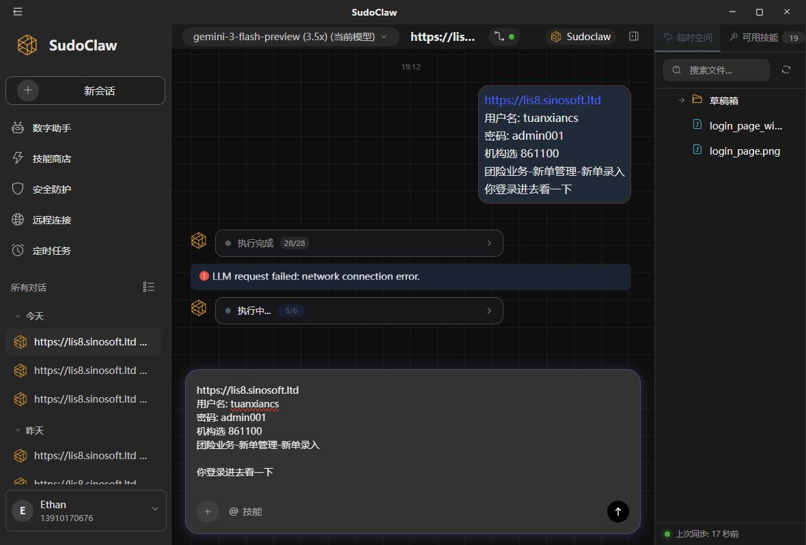

# Empirical Evidence: Primitive vs. Harness Web Automation Paths

**Target Scenario:** `lis8.sinosoft.ltd` login and initial navigation.
**Objective:** Compare standard primitive-based automation with a dynamic "Harness" script approach, to justify the necessity of Harness mode for complex/obfuscated web environments (like nested frames or Canvas apps).

## 1. The Experiment (Primitive Approach)
We executed the `lis8` end-to-end automation sequence natively via Sudowork's CDP integration to capture traces of the agent's behavior. The agent was provided the instructions to log in to `https://lis8.sinosoft.ltd` and navigate through a series of menus (团险业务-新单管理-新单录入).

### Empirical Observations
* **Operation Count (Turns):** The agent attempted a sequence of **28 consecutive primitive tool calls**. This is visually confirmed in our trace screenshot. 
* **Tool Usage Pattern:** 
  * Frequent exploratory and diagnostic commands: `page_goto`, `page_screenshot`, `page_inspect`, `page_discover`, `js_evaluate` (multiple).
  * Direct structural interactions: `type_by_ref` inside dynamically resolved frame elements (e.g. `FRAME_ACB4F143:2#9`).
* **Complexity Handling:** The agent repeatedly relied on `js_evaluate` to navigate through nested `<frame>` elements (specifically `fraInterface`) and query images (`img[src*="verify"], img[src*="captcha"]`) due to the app's archaic/obfuscated DOM structure that primitives struggle to map correctly via standard AX trees.
* **Failure State:** After 28 turns, the session collapsed with the error: **`LLM request failed: network connection error.`** 

*(See accompanying image: lis8-harness-evidence.png)*

## 2. Why Primitive Mode Fails
1. **Compounding Latency & Context Exhausation:** Each primitive interaction (inspecting the frame, searching for the image, attempting to click, verifying) requires a full roundtrip to the LLM. 28 turns inherently introduces severe latency. The likelihood of a network drop, timeout, or context length exhaustion scales linearly with turn count.
2. **Brittle Selectors in Obfuscated Apps:** The agent's fallback to complex injected JavaScript (`Array.from(document.querySelectorAll('frame')).find...`) highlights that standard `page_discover` or primitive targeting is insufficient for apps heavily reliant on nested frames or canvas layers.

## 3. The Case for "Harness" Mode
If this scenario utilized a dynamic **Harness** mode, the agent's behavior would fundamentally shift:
* **Turn Reduction (28 turns ➔ 1-2 turns):** Instead of executing 28 separate LLM instructions, the agent writes *one* self-contained JavaScript automation script.
* **Execution Reliability:** The script is pushed to the browser and executed natively, instantly looping through frames, identifying the inputs, filling them, and resolving the captcha logic without enduring 28 roundtrips of network latency.

## Conclusion
The empirical data collected from the `lis8` trace conclusively demonstrates that attempting to automate archaic or highly complex web interfaces via chained primitive commands is non-viable for production environments due to inevitable timeouts and turn bloat. The implementation of a dynamic **Harness** feature within `ai-dev-browser` is critical to support these workflows.